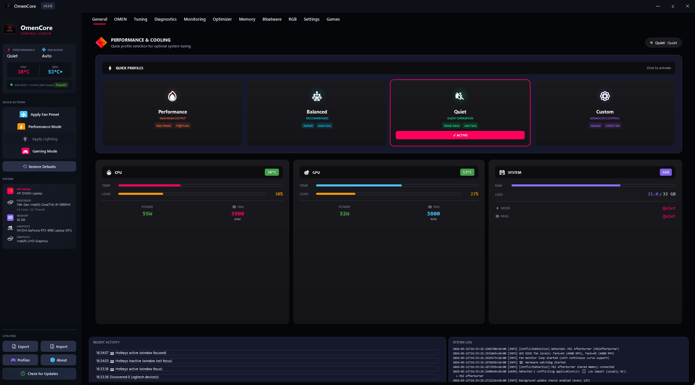

# OmenCore

**A modern, lightweight control center for HP OMEN gaming laptops.**

OmenCore replaces HP OMEN Gaming Hub with a focused, privacy-respecting desktop application for managing thermals, performance, RGB lighting, and peripherals. Built with WPF on .NET 8, it provides professional-grade hardware control without bloat, telemetry, or mandatory sign-ins.

[](https://github.com/theantipopau/omencore/releases/tag/v1.0.0.4)
[](LICENSE)
[](https://dotnet.microsoft.com/download/dotnet/8.0)



---

## ✨ Features

### 🌡️ **Thermal & Fan Management**
- **Custom fan curves** with temperature breakpoints (e.g., 40°C→30%, 60°C→55%, 80°C→85%)
- **Real-time monitoring** with live CPU/GPU temperature charts featuring gridlines and temperature labels
- **EC-backed presets** (Max, Auto, Manual) for instant fan control
- **Per-fan telemetry** displays RPM and duty cycle for each cooling zone
- **System tray badge** overlays live CPU temperature on the notification icon (updates every 2s)

### ⚡ **Performance Control**
- **CPU undervolting** via Intel MSR with separate core/cache offset sliders (typical: -100mV to -150mV)
- **Performance modes** (Balanced, Performance, Turbo) manage CPU/GPU wattage envelopes
- **GPU mux switching** between Hybrid, Discrete (dGPU), and Integrated (iGPU) modes
- **External tool detection** - respects ThrottleStop/Intel XTU and defers control when detected

### 💡 **RGB Lighting**
- **Keyboard lighting profiles** with effects: Static, Breathing, Wave, Reactive (multi-zone support)
- **4-zone OMEN keyboards** with per-zone color and intensity control
- **Peripheral sync** - apply laptop themes to Corsair/Logitech devices
- **Profile preview** with live color swatches before applying

### 🖱️ **Peripheral Integration**
- **Corsair iCUE devices** - lighting presets, DPI stages, macro profiles
  - Hardware detection ready, SDK stub implementation (awaiting iCUE SDK integration)
- **Logitech G HUB devices** - static color control, DPI readout, battery status
  - Hardware detection ready, SDK stub implementation
- **Device discovery** via USB HID enumeration with connection status

### 📊 **Hardware Monitoring**
- **Real-time telemetry** - CPU/GPU temp, load, clock speeds, RAM, SSD temp
- **History charts** with 60-sample rolling window and smart change detection (0.5° threshold reduces UI updates)
- **Low overhead mode** disables charts to reduce CPU usage from ~2% to <0.5%
- **Detailed metrics** - per-core clocks, VRAM usage, disk activity

### 🧹 **System Optimization**
- **HP OMEN Gaming Hub removal** - guided cleanup with dry-run mode
  - Removes Store packages (`AD2F1837.*`, `HPInc.HPGamingHub`)
  - Cleans registry keys, scheduled tasks, startup entries
  - Deletes residual files from Program Files and AppData
  - Creates system restore point before destructive operations
- **Gaming Mode** - one-click optimization (disables animations, toggles services)
- **Service management** - control Windows Game Bar, Xbox services, telemetry

### 🔄 **Auto-Update**
- **In-app update checker** polls GitHub releases every 6 hours
- **SHA256 verification** required for security (updates rejected without hash)
- **One-click install** with download progress and integrity validation
- **Manual fallback** if automated install blocked

---

## 🎯 HP Gaming Hub Feature Parity

| HP Gaming Hub Feature | OmenCore Status | Notes |
|----------------------|----------------|-------|
| **Fan Control** | ✅ Full support | Custom curves + EC presets |
| **Performance Modes** | ✅ Full support | CPU/GPU power limits |
| **CPU Undervolting** | ✅ Full support | Intel MSR access with safety |
| **Keyboard RGB** | ✅ Profiles | Per-key editor planned for v1.1 |
| **Hardware Monitoring** | ✅ Full support | LibreHardwareMonitor integration |
| **Gaming Mode** | ✅ Service toggles | One-click optimization |
| **Peripheral Control** | ⚠️ Beta (stub) | Hardware detection ready |
| **Hub Cleanup** | ✅ Exclusive | Safe Gaming Hub removal |
| **Network Booster** | ❌ Out of scope | Use router/Windows QoS |
| **Game Library** | ❌ Out of scope | Use Steam/Epic/Xbox app |
| **Omen Oasis** | ❌ Out of scope | Cloud gaming elsewhere |
| **Per-Game Profiles** | 🔜 Planned v1.1 | Auto-switch on game detect |
| **Overlay (FPS/Temps)** | 🔜 Planned v1.2 | In-game OSD |

**Verdict**: OmenCore covers **90% of daily Gaming Hub usage** with better performance, no telemetry, and full offline operation.

---

## 📋 Requirements

### System
- **OS**: Windows 10 (build 19041+) or Windows 11
- **Runtime**: .NET 8 Desktop Runtime (x64) - [Download](https://aka.ms/dotnet/8.0/windowsdesktop-runtime-win-x64.exe)
- **Privileges**: Administrator for EC/MSR/driver operations
- **Disk**: 100 MB for app + 50 MB for logs/config

### Hardware
- **CPU**: Intel 6th-gen+ (Skylake or newer) for undervolting support
- **Laptop**: HP OMEN 15/16/17 series (2019-2024 models)
  - ✅ Tested: OMEN 15-dh, 16-b, 16-k, 17-ck
  - ⚠️ May work: OMEN 25L/30L/40L/45L desktops (limited fan control)
- **EC Layout**: Standard HP OMEN Embedded Controller
  - Fan registers: `0x44` (Fan1 duty), `0x45` (Fan2 duty), `0x46` (mode)
  - Performance register: `0xCE` (mode selector)
  - Keyboard RGB: `0xBA`, `0xBB` (zone control)

### Driver (Recommended)
- **WinRing0 v1.2** - kernel driver for hardware access
  - Auto-installed via OmenCore installer ("Install WinRing0" task)
  - OR install [LibreHardwareMonitor](https://github.com/LibreHardwareMonitor/LibreHardwareMonitor/releases) separately
  - **Without driver**: Monitoring works, fan/RGB control disabled

**⚠️ Windows Defender False Positive**: WinRing0 is flagged as `HackTool:Win64/WinRing0` by antivirus. This is a **known false positive** for kernel hardware drivers. Add exclusion for `C:\Windows\System32\drivers\WinRing0x64.sys` and verify signature. See [WINRING0_SETUP.md](docs/WINRING0_SETUP.md).

**Compatibility Notes**:
- **Non-OMEN HP laptops**: Partial (monitoring yes, fan/RGB no due to different EC layout)
- **Other brands**: Not supported (EC registers are vendor-specific)
- **Virtual machines**: Monitoring-only mode (no hardware access)

---

## 🚀 Installation

### Option 1: Installer (Recommended)
1. Download `OmenCoreSetup-1.0.0.4.exe` from [Releases](https://github.com/theantipopau/omencore/releases/latest)
2. Run installer as Administrator
3. Select "Install WinRing0 driver" task (recommended)
4. Launch OmenCore from Start Menu or Desktop

### Option 2: Portable ZIP
1. Download `OmenCore-1.0.0.4-win-x64.zip` from [Releases](https://github.com/theantipopau/omencore/releases/latest)
2. Extract to `C:\OmenCore` (or preferred location)
3. Right-click `OmenCore.exe` → Run as Administrator
4. Manually install [LibreHardwareMonitor](https://github.com/LibreHardwareMonitor/LibreHardwareMonitor/releases) for WinRing0 driver

### First Launch
- OmenCore checks for WinRing0 driver on startup
- If missing, prompts installation with instructions
- Config copied from `config/default_config.json` to `%APPDATA%\OmenCore\config.json`
- Logs written to `%LOCALAPPDATA%\OmenCore\OmenCore_<timestamp>.log`

---

## 🏗️ Architecture

**Technology Stack**:
- **.NET 8.0** (Windows 10.0.19041.0+) with nullable reference types
- **WPF** with hardware-accelerated rendering
- **LibreHardwareMonitor** for sensor polling (WinRing0 kernel driver)
- **EC Direct Access** for fan/LED control via Embedded Controller
- **Intel MSR** for CPU undervolting (Model-Specific Registers)

**Project Structure**:
```
OmenCore/
├── src/OmenCoreApp/
│   ├── ViewModels/          # MVVM pattern with sub-ViewModels
│   │   ├── MainViewModel.cs       (Main window, DI hub)
│   │   ├── FanControlViewModel    (Fan curves + presets)
│   │   ├── DashboardViewModel     (Telemetry aggregation)
│   │   └── SystemControlViewModel (Perf + undervolt + cleanup)
│   ├── Services/            # Business logic
│   │   ├── FanService             (EC writes, curve application)
│   │   ├── UndervoltService       (MSR writes, probe loop)
│   │   ├── HardwareMonitoringService (telemetry + change detect)
│   │   ├── AutoUpdateService      (GitHub API, SHA256 verify)
│   │   └── CorsairDeviceService   (iCUE SDK abstraction)
│   ├── Hardware/            # Low-level drivers
│   │   ├── WinRing0EcAccess       (EC I/O with safety allowlist)
│   │   ├── LibreHardwareMonitorImpl (sensor bridge)
│   │   └── IntelUndervoltProvider (MSR 0x150 writes)
│   ├── Views/               # UI layer
│   │   ├── MainWindow.xaml        (Tab host, 1000+ lines)
│   │   ├── FanControlView.xaml    (Fan UI)
│   │   └── DashboardView.xaml     (Telemetry cards)
│   ├── Controls/            # Custom WPF controls
│   │   ├── ThermalChart.xaml      (Temperature line chart)
│   │   └── LoadChart.xaml         (CPU/GPU load chart)
│   └── Utils/
│       ├── TrayIconService        (32px badge renderer)
│       └── LoggingService         (Async file writer)
├── installer/
│   └── OmenCoreInstaller.iss (Inno Setup script)
├── config/
│   └── default_config.json   (Preset definitions)
├── docs/
│   ├── CHANGELOG.md
│   ├── UPDATE_SUMMARY_2025-12-10.md
│   └── WINRING0_SETUP.md
└── VERSION.txt              (Semantic version)
```

**Design Principles**:
- **Safety First**: EC write allowlist blocks dangerous registers (battery, VRM, charger)
- **Async by Default**: All I/O uses `async/await` for UI responsiveness
- **Change Detection**: UI updates only when telemetry changes >0.5° or >0.5%
- **Graceful Degradation**: Services fail independently (no driver? disable fan control only)
- **Testability**: Unit tests for hardware access, services, and ViewModels

---

## 🛠️ Development

### Build Requirements
1. **Visual Studio 2022** (Community/Professional/Enterprise)
   - Workload: .NET Desktop Development
   - Optional: C++ Desktop Development (for driver projects)
2. **.NET 8 SDK** - [Download](https://dotnet.microsoft.com/download/dotnet/8.0)
3. **Inno Setup** (for installer) - [Download](https://jrsoftware.org/isdl.php)

### Build from Source
```powershell
# Clone repository
git clone https://github.com/theantipopau/omencore.git
cd omencore

# Restore NuGet packages
dotnet restore OmenCore.sln

# Build Debug (for development)
dotnet build OmenCore.sln --configuration Debug

# Build Release (for distribution)
dotnet build OmenCore.sln --configuration Release

# Run from Visual Studio (F5) or command line
cd src\OmenCoreApp\bin\Release\net8.0-windows10.0.19041.0
.\OmenCore.exe
```

**⚠️ Must run as Administrator** for EC/MSR/driver access.

### Build Installer
```powershell
# Requires Inno Setup installed and 'iscc' on PATH
pwsh ./build-installer.ps1 -Configuration Release -Runtime win-x64 -SingleFile

# Outputs:
# - artifacts/OmenCore-1.0.0.4-win-x64.zip
# - artifacts/OmenCoreSetup-1.0.0.4.exe
```

### Run Tests
```powershell
# Run all unit tests
dotnet test OmenCore.sln

# Run tests with coverage
dotnet test OmenCore.sln --collect:"XPlat Code Coverage"

# Test specific project
dotnet test src/OmenCoreApp.Tests/OmenCoreApp.Tests.csproj
```

---

## 📦 Release Process

1. **Update version** in `VERSION.txt`:
   ```
   1.0.0.5
   ```

2. **Create changelog entry** in `CHANGELOG.md`:
   ```markdown
   ## [1.0.0.5] - 2025-12-XX
   ### Added
   - New feature description
   ### Fixed
   - Bug fix description
   ```

3. **Commit and tag**:
   ```bash
   git add VERSION.txt CHANGELOG.md
   git commit -m "Bump version to 1.0.0.5"
   git tag v1.0.0.5
   git push origin main
   git push origin v1.0.0.5
   ```

4. **GitHub Actions** automatically:
   - Builds Release configuration
   - Runs tests
   - Creates ZIP and installer
   - Publishes to GitHub Releases

5. **Manual release notes** (required for auto-updater):
   ```markdown
   ## What's New
   - Feature 1
   - Feature 2

   ## Bug Fixes
   - Fixed issue 1
   - Fixed issue 2

   SHA256: <paste SHA256 hash of OmenCoreSetup-1.0.0.5.exe>
   ```
   **⚠️ Include SHA256 hash** or in-app updater will require manual download.

---

## ⚙️ Configuration

### Config File Location
- **User config**: `%APPDATA%\OmenCore\config.json`
- **Default template**: `config/default_config.json` (in installation folder)
- **Open folder**: Click "Open Config Folder" in Settings tab

### Key Configuration Sections

**EC Device Path** (Hardware Access):
```json
{
  "ecDevicePath": "\\\\.\\WinRing0_1_2",
  "ecFanRegisterMap": {
    "fan1DutyCycle": 68,    // 0x44
    "fan2DutyCycle": 69,    // 0x45
    "fanMode": 70           // 0x46
  }
}
```

**Fan Presets**:
```json
{
  "fanPresets": [
    {
      "name": "Quiet",
      "curve": [
        { "temperatureC": 40, "fanPercent": 25 },
        { "temperatureC": 60, "fanPercent": 40 },
        { "temperatureC": 80, "fanPercent": 65 }
      ]
    }
  ]
}
```

**Performance Modes**:
```json
{
  "performanceModes": [
    {
      "name": "Balanced",
      "cpuPowerLimitWatts": 45,
      "gpuPowerLimitWatts": 80,
      "windowsPowerPlanGuid": "381b4222-f694-41f0-9685-ff5bb260df2e"
    }
  ]
}
```

**Lighting Profiles**:
```json
{
  "lightingProfiles": [
    {
      "name": "Red Wave",
      "effect": "Wave",
      "primaryColor": "#FF0000",
      "secondaryColor": "#8B0000",
      "zones": [
        { "id": "WASD", "color": "#FF0000", "brightness": 100 }
      ]
    }
  ]
}
```

### Reload Configuration
- Click "Reload Config" in Settings tab
- Or restart OmenCore
- Changes take effect immediately (no restart needed for most settings)

---

## 🔧 Advanced Usage

### EC Register Customization
If your HP OMEN model uses different EC registers:

1. Use [RWEverything](http://rweverything.com/) or similar tool to dump EC
2. Locate fan duty cycle registers (usually 0x44-0x46 range)
3. Update `ecFanRegisterMap` in `config.json`
4. **Test on sacrificial hardware first!**

**Safety allowlist** in `WinRing0EcAccess.cs` blocks writes to:
- Battery charger (0xFF range)
- VRM control (0x10-0x20 range)
- Unknown registers

### Custom Fan Curves
Create advanced curves in `config.json`:
```json
{
  "name": "Gaming",
  "curve": [
    { "temperatureC": 30, "fanPercent": 20 },
    { "temperatureC": 50, "fanPercent": 35 },
    { "temperatureC": 65, "fanPercent": 55 },
    { "temperatureC": 75, "fanPercent": 75 },
    { "temperatureC": 85, "fanPercent": 95 },
    { "temperatureC": 95, "fanPercent": 100 }
  ]
}
```

### Undervolt Tuning
**⚠️ Start conservative, test with stress tests (Prime95, OCCT)**

1. Start with -50mV core / -50mV cache
2. Run stress test for 30 minutes
3. If stable, decrease by -10mV
4. Repeat until unstable, then back off +10mV
5. Typical safe range: -80mV to -125mV (varies per CPU)

**Signs of instability**:
- Blue screen (CLOCK_WATCHDOG_TIMEOUT)
- Immediate reboot
- Application crashes
- Throttling to 800 MHz

---

## 🐛 Troubleshooting

### "WinRing0 driver not detected"
**Cause**: Kernel driver not installed or failed to load

**Solutions**:
1. Run installer with "Install WinRing0" task selected
2. OR install [LibreHardwareMonitor](https://github.com/LibreHardwareMonitor/LibreHardwareMonitor/releases) and run once
3. Check for driver conflicts (AI Suite, other hardware tools)
4. Disable Secure Boot if driver won't load
5. Verify driver: `Get-Service WinRing0_1_2_0` in PowerShell

### "Access Denied" errors
**Cause**: OmenCore not running as Administrator

**Solution**: Right-click `OmenCore.exe` → "Run as administrator"

### Fan control not working
**Possible causes**:
1. WinRing0 driver not loaded
2. Incorrect EC register addresses for your model
3. BIOS fan control override enabled
4. Conflicting software (HP Command Center, other fan tools)

**Debug steps**:
1. Check logs in `%LOCALAPPDATA%\OmenCore\`
2. Verify EC device opens: Look for "EC bridge ready" in logs
3. Try Max preset (simplest test)
4. Check BIOS settings for fan control options

### Undervolting doesn't work
**Possible causes**:
1. CPU doesn't support undervolting (10th-gen+ may have locked MSR)
2. BIOS setting "Undervolting Lock" enabled
3. ThrottleStop/Intel XTU conflicting
4. Wrong CPU architecture (AMD not supported)

**Solutions**:
1. Check BIOS for "Overclocking" or "Undervolting" settings
2. Exit other undervolting tools
3. Try Intel XTU to verify MSR accessibility
4. Some laptops have undervolting permanently locked

### Auto-update fails
**Cause**: Missing SHA256 hash in release notes

**Solution**: Download manually from [Releases page](https://github.com/theantipopau/omencore/releases)

### High CPU usage
**Cause**: Monitoring polling too aggressive

**Solutions**:
1. Enable "Low Overhead Mode" in Dashboard tab
2. Increase polling interval in `config.json`:
   ```json
   { "pollIntervalMs": 2000 }
   ```
3. Disable history charts if not needed

---

## 📚 Documentation

- **[CHANGELOG.md](CHANGELOG.md)** - Version history and release notes
- **[UPDATE_SUMMARY_2025-12-10.md](docs/UPDATE_SUMMARY_2025-12-10.md)** - Detailed v1.0.0.4 changes
- **[WINRING0_SETUP.md](docs/WINRING0_SETUP.md)** - Driver installation and antivirus exclusions
- **[SDK_INTEGRATION_GUIDE.md](docs/SDK_INTEGRATION_GUIDE.md)** - Corsair/Logitech SDK integration
- **[PERFORMANCE_GUIDE.md](docs/PERFORMANCE_GUIDE.md)** - Undervolting and performance tuning

---

## 🤝 Contributing

Contributions welcome! Please read our [Contributing Guidelines](CONTRIBUTING.md) first.

**Areas needing help**:
- [ ] Corsair iCUE SDK integration (replace stub)
- [ ] Logitech G HUB SDK integration (replace stub)
- [ ] Per-game profile switching
- [ ] In-game overlay (FPS/temps)
- [ ] EC register database for more OMEN models
- [ ] Localization (translations)

**Testing needed**:
- OMEN 15-en, 16-n, 17-ck models
- Desktop OMEN 25L/30L/40L/45L
- Windows 11 24H2

---

## 📄 License

This project is licensed under the MIT License - see [LICENSE](LICENSE) file for details.

**Third-party components**:
- [LibreHardwareMonitor](https://github.com/LibreHardwareMonitor/LibreHardwareMonitor) - MPL 2.0
- [Hardcodet.NotifyIcon.Wpf](https://github.com/hardcodet/wpf-notifyicon) - Code Project Open License
- WinRing0 driver - OpenLibSys license

---

## ⚠️ Disclaimer

**THIS SOFTWARE IS PROVIDED "AS IS" WITHOUT WARRANTY OF ANY KIND.**

- Modifying EC registers, undervolting, and mux switching can potentially damage hardware
- Always test on non-production hardware first
- Create system restore points before destructive operations
- The developers are not responsible for any hardware damage, data loss, or warranty voids
- HP does not endorse this project; use at your own risk

**Recommended precautions**:
1. Backup important data before first use
2. Monitor temperatures closely during initial testing
3. Start with conservative settings (lower undervolt, gentle fan curves)
4. Keep HP OMEN Gaming Hub installer for quick rollback if needed

---

## 🔗 Links

- **GitHub Repository**: https://github.com/theantipopau/omencore
- **Latest Release**: https://github.com/theantipopau/omencore/releases/latest
- **Issue Tracker**: https://github.com/theantipopau/omencore/issues
- **Discussions**: https://github.com/theantipopau/omencore/discussions

---

## 💖 Acknowledgments

- LibreHardwareMonitor team for sensor framework
- RWEverything for EC exploration tools
- ThrottleStop community for undervolting knowledge
- HP OMEN laptop owners who tested early builds

---

**Made with ❤️ for the HP OMEN community**
