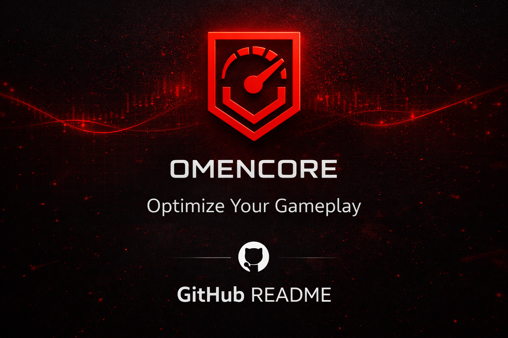

<div align="center">



# OmenCore

## A Modern, Lightweight Control Center for HP OMEN & Victus Gaming Laptops

</div>

---

**OmenCore** is a **complete, independent replacement** for HP OMEN Gaming Hub. No dependencies. No OGH services. No bloatware, telemetry, or ads. Built on .NET 8, it delivers professional-grade hardware control using native WMI BIOS commands that work directly with your laptop's firmware.

### ✨ Why OmenCore?

| Feature | Status |
|---------|--------|
| **100% OGH-Independent** | ✅ Works without OMEN Gaming Hub installed |
| **Zero Bloatware** | ✅ Self-contained artifacts, no runtime installs |
| **No Telemetry** | ✅ Your data stays on your machine |
| **Ad-Free** | ✅ Clean, focused interface |
| **Offline Operation** | ✅ No sign-in required, fully local control |
| **Cross-Platform** | ✅ Windows WPF + Linux CLI & Avalonia GUI |

---

### 🎯 Quick Links

[](https://github.com/theantipopau/omencore/releases/tag/v3.3.0)
[](LICENSE)
[](https://dotnet.microsoft.com/download/dotnet/8.0)
[](https://discord.gg/9WhJdabGk8)
[](https://www.paypal.com/donate/?business=XH8CKYF8T7EBU&no_recurring=0&item_name=Thank+you+for+your+generous+donation%2C+this+will+allow+me+to+continue+developing+my+programs.&currency_code=AUD)

---

### 📸 Interface Preview


## 🚀 **Quick Start**

### Windows

1. Download `OmenCoreSetup-3.3.0.exe` from [Releases](https://github.com/theantipopau/omencore/releases/tag/v3.3.0)
2. Run as Administrator
3. Launch OmenCore from the Start Menu

→ **[Full Installation Guide](INSTALL.md#-windows-installation)**

### Linux (CachyOS • Arch • Ubuntu • Fedora)

```bash
# Download & Extract
wget https://github.com/theantipopau/omencore/releases/download/v3.3.0/OmenCore-3.3.0-linux-x64.zip
mkdir -p OmenCore-linux-x64
unzip OmenCore-3.3.0-linux-x64.zip -d OmenCore-linux-x64
cd OmenCore-linux-x64
chmod +x omencore-cli omencore-gui

# CLI: Check status
sudo ./omencore-cli status

# GUI: Launch Avalonia
sudo ./omencore-gui
```

→ **[Complete Linux Guide](docs/LINUX_INSTALL_GUIDE.md)** | **[Quick Reference](INSTALL.md#-linux-installation)**

### Linux issue reporting (one-command triage bundle)

When reporting Linux model support issues (for example missing `hp-wmi` fan interfaces), run:

```bash
./qa/collect-linux-triage.sh
```

This generates a timestamped folder with:
- `omencore-linux-triage.txt` (kernel/OS, CLI status/diagnose output, sysfs snapshots)
- optional `acpidump.dat` when `acpidump` is available

Attach those files to your GitHub issue for faster triage.

## 🔥 **What's New in v3.3.0**

v3.3.0 is the largest stability-and-polish release since v3.1.0 — 80 items shipped across fan-curve stability, sleep recovery, monitoring reliability, Bloatware Manager usability, OSD, RGB subsystem hardening, AMD power tuning, Lite Mode, and dozens of community-reported fixes.

### Critical Fixes

- **Fan curve no longer self-destructs** — Root-cause fixed: presets became permanently broken after first apply when OGH was running or fans were already at-target speed (Ryua report)
- **Restore Defaults no longer freezes OmenCore** — Eliminated a UI-thread deadlock in `KeyboardLightingService.RestoreDefaults()` on V2 keyboards (GitHub #100 Bug #1)
- **Fan preset switching no longer stalls the UI** — All `ApplyPreset()` calls moved off the WPF UI thread via `Task.Run`
- **Hardware monitoring halt / watchdog failsafe fans fixed** — Cross-thread dispatcher exception in `LightingViewModel` starved the monitoring heartbeat, triggering fail-safe 100% fans. Fixed with dispatcher marshal + subscriber isolation + extended CPU fallback read timeout
- **Bloatware Manager Remove/Restore buttons now functional** — `SelectedApp` setter was raising `PropertyChanged` instead of `CanExecuteChanged`; buttons were permanently disabled after scan

### Thermal Fixes

- **CPU temperature stays current after sleep** — Hardware worker and fallback monitor properly restarted on resume; no more frozen 44°C post-wakeup (GitHub #102)
- **V1 BIOS fans now reach 0 RPM at idle** — Residual duty-floor from the Performance→Default kick cleared so BIOS EC can regulate freely (GitHub #100 Bug #4)
- **V1 BIOS fans no longer stick at 100%** after exiting Performance preset (GitHub #102)

### UI and UX

- **OSD DPI fix** — All six anchor positions land correctly at 125%, 150%, and 175% DPI scaling
- **Quick Access reordered** — Quiet → Auto → Curve → Max; “Curve” applies saved fan preset with active-curve tooltip
- **Fan/performance decoupling badges** — Visible `Fan independent` / `Fan linked` state in Fan Control, System Control, and Quick Access
- **AMD CPU power tuning** — STAPM/Tctl controls promoted to first-class tuning surface with PawnIO/admin capability gating
- **Lite Mode** — Persisted beginner-UI toggle hides advanced tabs; settings-search indexed
- **All disabled buttons now show tooltips** — `ToolTipService.ShowOnDisabled` applied globally on `ModernButton` and `PresetButton` base styles; no more invisible why-is-this-grey mystery
- **OGH unsupported-command log noise eliminated** — WARN permanently silenced to Debug after 5 occurrences; logs are no longer flooded on OGH-adjacent hardware
- **Startup hardware restore safety guardrails** — `EnableStartupHardwareRestore` disabled by default; blocked on OMEN 16 and Victus models where CMOS state loss has been observed
- **MSI Afterburner coexistence fix** — Stale GPU load/clock cache no longer reused across monitoring intervals; GPU engine counter summing corrected so Afterburner's shared counter doesn't push readings above 100%

### Platform and Subsystems

- **Audio-reactive RGB** — Real WASAPI loopback capture; Audio Reactive scene registered across all active providers
- **Per-key keyboard lighting** — Interactive 84-cell OMEN Max grid editor wired to V2 HID backend
- **Full RGB provider hardening** — Razer back-off reconnect, Logitech health-check, Corsair mode-synced gradients, two-phase commit sync (#13–#18)
- **Unified monitoring pipeline + timer governance** — 1 s active / 5 s idle cadence, Critical/VisibleOnly/Optional tier registry, coalesced dispatcher fan-out (#25–#31)

→ **[Full Changelog](docs/CHANGELOG_v3.3.0.md)**

---

## 📦 **Downloads & Artifacts**

**Version:** v3.3.0 | **Status:** Released

| Download | Platform | Details |
|----------|----------|----------|
| **OmenCoreSetup-3.3.0.exe** | Windows | Installer (Recommended) — Includes .NET 8 runtime |
| **OmenCore-3.3.0-win-x64.zip** | Windows | Portable — Extract and run, no installation |
| **OmenCore-3.3.0-linux-x64.zip** | Linux | CLI + Avalonia GUI, self-contained runtime |

### SHA256

```text
(SHA256 hashes are published on the [v3.3.0 GitHub Release page](https://github.com/theantipopau/omencore/releases/tag/v3.3.0))
```

> Security: release hashes are documented in [CHANGELOG_v3.3.0.md](docs/CHANGELOG_v3.3.0.md) and the [v3.3.0 release page](https://github.com/theantipopau/omencore/releases/tag/v3.3.0).

---

## 🔧 **Features**

### Thermal & Fan Management

- Custom fan curves with temperature breakpoints — CPU and GPU fans controlled independently
- WMI BIOS control — no driver required, works on AMD and Intel models
- EC-backed presets (Max, Auto, Manual) for instant fan switching
- Real-time monitoring with live CPU/GPU temperature history charts
- Per-fan telemetry — RPM and duty cycle for each cooling zone
- System tray badge — live CPU temperature on the notification icon
- CPU Temperature Limit — TCC offset control (Intel only)
- Fan preset save/load — name, export, import, and share `.omencore` profiles
- 0% duty remapping — curve interpolation can never stall fans below the configured minimum (v3.2.0)

### Performance Control

- CPU undervolting via Intel MSR with independent core/cache offset sliders (typical safe range: -80 to -125 mV)
- Performance modes (Quiet, Balanced, Performance, Turbo) — CPU/GPU wattage envelope management (decoupled from fan mode in v3.3.0)
- GPU Power Boost — +15W Dynamic Boost (PPAB)
- GPU mux switching — Hybrid, Discrete (dGPU), and Integrated (iGPU)
- Per-game profiles — auto-switch on game process detection
- External tool detection — defers MSR control when ThrottleStop/Intel XTU is active

### RGB Lighting

- Keyboard lighting profiles — Static, Breathing, Wave, Reactive (multi-zone)
- 4-zone OMEN keyboards with per-zone color and intensity
- Per-key RGB on OMEN Max 16 (individual key addressing)
- Peripheral sync — apply themes to Corsair/Logitech/Razer devices
- Linux sysfs-based RGB capability detection (v3.2.0)

### Hardware Monitoring

- Real-time telemetry — CPU/GPU temp, load, clocks, RAM usage, SSD temp
- Telemetry state model: `Valid`, `Inactive`, `Unavailable`, `Stale`, `Degraded`, `Invalid`
- Dashboard banners for Stale and Degraded states with contextual messaging (v3.2.0)
- Rolling 60-sample history charts with 0.5° / 0.5% change threshold
- Low overhead mode — disables charts; reduces idle CPU from ~2% to <0.5%

### System Optimization

- HP OMEN Gaming Hub removal — guided cleanup with dry-run mode
- Gaming Mode — one-click service/animation toggle
- Battery care — adjustable charge limit (60–100%)
- OSD in-game overlay — click-through, configurable metrics
- Memory optimizer — smart/deep RAM clean using Windows native API
- Bloatware scanner — AppX detection, startup item manager, scheduled task cleaner

### Auto-Update

- Polls GitHub Releases every 6 hours
- SHA256 verification required (updates rejected without hash for security)
- One-click download with progress indicator and integrity validation
- Manual fallback if SHA256 is absent from release notes

---

## 🎯 HP Gaming Hub Feature Parity

OmenCore is designed to **completely replace** OMEN Gaming Hub.

| HP Gaming Hub Feature | OmenCore | Notes |
|----------------------|---------|-------|
| Fan Control | ✅ Full | Custom curves + WMI BIOS presets |
| Performance Modes | ✅ Full | CPU/GPU power envelope via WMI |
| CPU Undervolting | ✅ Full | Intel MSR with safety clamping |
| GPU Power Boost | ✅ Full | +15W Dynamic Boost (PPAB) |
| Keyboard RGB | ✅ Full | Per-zone + per-key on supported models |
| Hardware Monitoring | ✅ Full | LibreHardwareMonitor integration |
| Gaming Mode | ✅ Full | Service/animation optimization |
| Battery Care | ✅ Full | Adjustable 60–100% charge limit |
| Peripheral Control | ⚠️ Beta | Corsair/Logitech/Razer hardware detection ready |
| Hub Cleanup | ✅ Exclusive | Safe OGH removal tool |
| Per-Game Profiles | ✅ Full | Auto-switch on process detection |
| In-Game Overlay | ✅ Full | Click-through OSD |
| Network Booster | ❌ Out of scope | Use router/Windows QoS |
| Game Library | ❌ Out of scope | Use Steam/Epic/Xbox app |
| Omen Oasis | ❌ Out of scope | Cloud gaming out of scope |

**OmenCore covers 100% of essential Gaming Hub features** — with better performance, no telemetry, no ads, and full offline operation.

---

## 📋 Requirements

### System

- **OS:** Windows 10 (build 19041+) or Windows 11
- **Runtime:** Self-contained — .NET 8 embedded, no separate installation needed
- **Privileges:** Administrator for WMI BIOS/EC/MSR operations
- **Disk:** ~120 MB for app + ~50 MB logs/config
- **OGH:** NOT required — OmenCore works without OMEN Gaming Hub

### Hardware

- **CPU:** Intel 6th-gen+ for undervolting/TCC offset; AMD Ryzen supported for monitoring and fan control
- **Laptop:** HP OMEN 15/16/17 series and HP Victus (2019–2025 models)
  - ✅ Tested: OMEN 15-dh, 16-b, 16-k, 17-ck (2023/2024), Victus 15/16
  - ✅ OMEN Max 16 (2025): per-key RGB, RTX 50-series, full support
  - ✅ OMEN Transcend 14/16: WMI BIOS support
  - ✅ 2023+ models: full WMI BIOS support, no OGH needed
- **Desktop:** HP OMEN 25L/30L/40L/45L (limited support; monitoring, profiles, and OGH cleanup functional)

### Fan Control Driver Priority

1. **WMI BIOS** (default) — no driver, works on all OMEN laptops
2. **EC via PawnIO** — Secure Boot compatible
3. **EC via WinRing0** — legacy; may need Secure Boot disabled
4. **OGH Proxy** — last resort fallback

### Optional Drivers

- **PawnIO** — recommended for advanced EC/MSR access (Secure Boot compatible)
- **WinRing0 v1.2** — legacy kernel driver

> **Antivirus note:** WinRing0 is flagged as `HackTool:Win64/WinRing0` by Windows Defender — this is a known false positive for hardware drivers. See [ANTIVIRUS_FAQ.md](docs/ANTIVIRUS_FAQ.md) and [DEFENDER_FALSE_POSITIVE.md](docs/DEFENDER_FALSE_POSITIVE.md) for exclusion instructions.

**Compatibility:**
- HP Spectre: fan control and monitoring work; CPU/GPU power limits unavailable (different EC layout)
- HP Victus: fan control, monitoring, and keyboard backlight work; GPU TGP/PPAB and CPU undervolting unavailable (BIOS does not expose these on Victus)
- Non-OMEN HP laptops: monitoring only
- Other brands: not supported
- Virtual machines: monitoring-only mode

---

## 🏗️ Architecture

**Stack:** .NET 8.0 / WPF (Windows) / Avalonia (Linux) / LibreHardwareMonitor / EC Direct / Intel MSR

```
OmenCore/
├── src/OmenCoreApp/              # Windows WPF app (ViewModels, Views, Services, Controls)
├── src/OmenCore.HardwareWorker/  # Out-of-process hardware worker — crash isolation
├── src/OmenCore.Avalonia/        # Avalonia cross-platform UI (ViewModels, Services)
├── src/OmenCore.Desktop/         # Avalonia desktop shell + settings persistence
├── src/OmenCore.Linux/           # Linux hardware: hp-wmi, ec_sys, sysfs RGB probing
├── installer/                    # Inno Setup script
├── config/                       # default_config.json
├── docs/                         # Changelogs, audit reports, guides
└── VERSION.txt                   # Current: 3.3.0
```

**Principles:** Safety-first EC write allowlist · Async by default · Telemetry change-detection (0.5°/0.5%) · Graceful per-service degradation · Out-of-process crash isolation

---

## 🛠️ Development

### Requirements

- Visual Studio 2022 (Community+), workload: .NET Desktop Development
- .NET 8 SDK — [download](https://dotnet.microsoft.com/download/dotnet/8.0)
- Inno Setup (installer only) — [download](https://jrsoftware.org/isdl.php)

### Build

```powershell
git clone https://github.com/theantipopau/omencore.git
cd omencore
dotnet restore OmenCore.sln
dotnet build OmenCore.sln --configuration Release

# Run (Administrator required)
cd src\OmenCoreApp\bin\Release\net8.0-windows10.0.19041.0
.\OmenCore.exe
```

### Build Installer

```powershell
pwsh ./build-installer.ps1
# Optional: -Configuration Release -Runtime win-x64 (these are the defaults)
# Outputs: artifacts/OmenCoreSetup-3.3.0.exe and artifacts/OmenCore-3.3.0-win-x64.zip
```

### Tests

```powershell
dotnet test OmenCore.sln
dotnet test OmenCore.sln --collect:"XPlat Code Coverage"
```

### Linux triage bundle (maintainers/reporters)

```bash
./qa/collect-linux-triage.sh [output_dir] [bin_dir]
# Example:
./qa/collect-linux-triage.sh ./triage ./
```

### Release Process

1. Update `VERSION.txt`
2. Add changelog under `docs/CHANGELOG_vX.Y.Z.md`
3. Tag and push: `git tag vX.Y.Z && git push origin main --tags`
4. Include SHA256 hash in GitHub Release notes — required for the in-app auto-updater

---

## 🐛 Troubleshooting

| Symptom | Likely Cause | Fix |
|---------|-------------|-----|
| Fan control has no effect | WMI not supported on this model | Try PawnIO/ec_sys mode; check logs |
| Access denied errors | Not running as Administrator | Right-click → Run as administrator |
| WinRing0 not detected | Driver blocked by Secure Boot | Switch to PawnIO (Secure Boot compatible) |
| Undervolting not working | MSR locked in BIOS | Check BIOS overclocking settings; verify with Intel XTU |
| Auto-update fails | SHA256 missing from release notes | Download manually from the Releases page |
| High CPU at idle | Charts polling too aggressively | Enable Low Overhead Mode in Dashboard settings |
| Linux: permission denied | Hardware access needs root | Run with `sudo` |
| Linux: ec_sys not found | Module not in this kernel | Use `hp-wmi` on 2023+ models |

Detailed logs are in `%LOCALAPPDATA%\OmenCore\`. On Linux, use `sudo omencore-cli --report > report.txt` for a diagnostics bundle.

> **AMD undervolting:** Ryzen does not support Intel-style MSR undervolting. Use BIOS Curve Optimizer or Ryzen Master. OmenCore still provides full fan control, monitoring, RGB, and performance modes on AMD systems.

---

## 📖 Version History

| Version | Key Changes |
|---------|------------|
| **v3.3.0** | Fan curve stability, sleep recovery, OSD DPI/visual, RGB hardening, AMD power tuning, Lite Mode (74 items) |
| **v3.2.5** | Worker reconnect fix, fan/performance decoupling, 8BB1 model support, Quick Access improvements |
| **v3.2.1** | 23-fix hotfix rollup: telemetry hardening, OSD/premium UI polish, portable log hygiene, CPU temp oscillation guard |
| **v3.2.0** | Dashboard row fix, fan 0% safety, frozen temp watchdog, Avalonia preset save, Linux RGB detection |
| **v3.1.1** | CPU temp regression (17-ck1xxx), fan 0-RPM guard, worker crash on GPU driver install, PE header validation |
| **v3.1.0** | Telemetry state model, sleep/suspend fan hardening (#77), OMEN MAX 16 CPU temp override (#78) |
| **v3.0.2** | Hotfix: PE header validation, WinRing0 hash check |
| **v3.0.0** | Multi-project architecture, out-of-process HardwareWorker, full Avalonia Linux GUI |
| **v2.9.0** | Intel Core Ultra CPU temp fix, EC write reduction, memory optimizer, Afterburner coexistence |
| **v2.8.0** | AMD GPU OC (ADL2), OMEN desktop support, game library, Linux hwmon PWM control |

Older release notes: [docs/](docs/)

---

## 📚 Documentation

- [INSTALL.md](INSTALL.md) — Full installation guide for Windows and Linux
- [docs/LINUX_INSTALL_GUIDE.md](docs/LINUX_INSTALL_GUIDE.md) — Detailed Linux setup
- [docs/ANTIVIRUS_FAQ.md](docs/ANTIVIRUS_FAQ.md) — Antivirus false positive handling
- [docs/DEFENDER_FALSE_POSITIVE.md](docs/DEFENDER_FALSE_POSITIVE.md) — Windows Defender exclusion steps
- [docs/WINRING0_SETUP.md](docs/WINRING0_SETUP.md) — WinRing0 driver setup
- [docs/CHANGELOG_v3.3.0.md](docs/CHANGELOG_v3.3.0.md) — Current release notes

---

## 🤝 Contributing

Contributions welcome! Priority areas:

- [ ] Corsair iCUE / Logitech G HUB SDK implementations (replace stubs)
- [ ] EC register maps for models not yet in the allowlist
- [ ] Testing on OMEN Max 16/17 (2025) with RTX 50-series
- [ ] Testing on OMEN 15-en, 16-n series
- [ ] Localization / translations

---

## ⚠️ Disclaimer

This software is provided "as is" without warranty. Modifying EC registers, undervolting, and mux switching can potentially damage hardware. Always create system restore points before making changes. The developers are not responsible for hardware damage, data loss, or warranty voids. HP does not endorse this project; use at your own risk.

---

## 🔗 Links

- **GitHub:** https://github.com/theantipopau/omencore
- **Releases:** https://github.com/theantipopau/omencore/releases/latest
- **Issues:** https://github.com/theantipopau/omencore/issues
- **Discord:** https://discord.gg/9WhJdabGk8
- **Donate:** https://www.paypal.com/donate/?business=XH8CKYF8T7EBU

---

## 📄 License

MIT License — see [LICENSE](LICENSE) for details.

**Third-party components:**
- [LibreHardwareMonitor](https://github.com/LibreHardwareMonitor/LibreHardwareMonitor) — MPL 2.0
- [Hardcodet.NotifyIcon.Wpf](https://github.com/hardcodet/wpf-notifyicon) — CPOL
- WinRing0 driver — OpenLibSys license

---

*Made with care for the HP OMEN community.*
