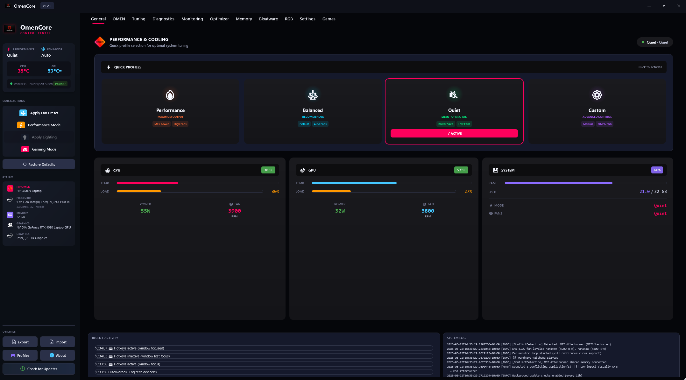

# OmenCore

**A modern, lightweight, and fully independent control center for HP OMEN & Victus gaming laptops.**

> 💻 **Laptops + Desktops** — OmenCore supports HP OMEN & Victus **laptops** and OMEN **desktops** (25L, 30L, 35L, 40L, 45L). Desktop fan control uses WMI commands with RPM readback and performance mode support. OMEN desktop RGB lighting is supported via USB HID.

OmenCore is a **complete replacement** for HP OMEN Gaming Hub - no OGH services required, no bloatware, no telemetry, no ads. Built with WPF on .NET 8, it provides professional-grade hardware control using native WMI BIOS commands that work directly with your laptop's firmware.

**🎯 Key Differentiators:**
- ✅ **100% OGH-Independent** - Works without OMEN Gaming Hub installed
- ✅ **No Bloatware** - Single 70MB self-contained executable
- ✅ **No Telemetry** - Your data stays on your machine
- ✅ **No Ads** - Clean, focused interface
- ✅ **No Sign-In Required** - Full offline operation
- 🐧 **Cross-Platform** - Windows GUI + Linux CLI & Avalonia GUI

[](https://github.com/theantipopau/omencore/releases/tag/v3.0.0)
[](LICENSE)
[](https://dotnet.microsoft.com/download/dotnet/8.0)
[](https://omencore.info)
[](https://discord.gg/9WhJdabGk8)
[](https://www.paypal.com/donate/?business=XH8CKYF8T7EBU&no_recurring=0&item_name=Thank+you+for+your+generous+donation%2C+this+will+allow+me+to+continue+developing+my+programs.&currency_code=AUD)



---

## 🚀 Quick Installation

### Windows
```
1. Download OmenCore-3.0.0-win-x64.zip from Releases
2. Extract and run OmenCore.exe as Administrator
3. (Optional) Check "Install PawnIO driver" for advanced features
4. Launch from extracted folder
```
**[📖 Full Windows Installation Guide](INSTALL.md#-windows-installation)**

### Linux (CachyOS, Arch, Ubuntu, Fedora)
```bash
# Download and extract
wget https://github.com/theantipopau/omencore/releases/download/v3.0.0/OmenCore-3.0.0-linux-x64.zip
unzip OmenCore-3.0.0-linux-x64.zip

# CLI
chmod +x omencore-cli && sudo ./omencore-cli status

# GUI (Avalonia)
chmod +x omencore-gui && sudo ./omencore-gui
```
**[?? Full Linux Installation Guide](docs/LINUX_INSTALL_GUIDE.md)** | [Quick Reference](INSTALL.md#-linux-installation)

---

## 🆕 What's New in v3.0.0

### 🏗️ Architecture Overhaul
- **Self-Sustaining Monitoring** — Complete independence from LibreHardwareMonitor, WinRing0, NVML. Uses WMI BIOS + NVAPI natively
- **Zero Silent Failures** — Early-exit guards removed; all sensor sources (NVAPI, PerformanceCounter, ACPI, PawnIO, SSD/battery) work independently

### 🐛 Critical Bug Fixes (7 Regressions)
- **GPU Telemetry Lockup** — NVAPI errors cause 60s auto-recovery instead of permanent telemetry loss
- **OMEN 16-wf1xxx Fan Control** — ProductId 8BAB now has proper ModelCapabilityDatabase entry; WMI path fixed
- **Fan Auto Mode 0 RPM** — Debounce window properly resets after profile switches
- **Monitor Loop Hangs** — Permanent exit on consecutive errors replaced with 10s backoff + restart
- **Startup Freeze** — WinRing0 check (~17s WMI scan) → instant registry lookup (<1ms); PerformanceCounter moved to background thread
- **All Sensors 0°C** — Individual sources now work when WMI BIOS is unavailable

### ✨ Major Features
- **Fan Diagnostics** — Guided sequential test at 30% → 60% → 100% with PASS/FAIL results per fan level
- **Memory Optimizer Tab** — Real-time RAM monitoring + Smart/Deep clean + configurable auto-clean intervals
- **Keyboard Lighting Enhancements** — Native WMI brightness control (0–100%) + LED animation effects (Breathing, ColorCycle, Wave)
- **V2 Keyboard Engine** — PawnIO EC-direct backend; auto-promotes verified models (8A14, 8A15, 8BAD) without config flags
- **Headless Mode** — `--headless` flag for server/HTPC operation; all features work without GUI
- **Profile Scheduler** — Time-of-day automation rules for fan presets and performance modes

### 🎨 GUI Improvements
- **Temperature Chart Time Ranges** — New 1m / 5m / 15m / 30m selector above monitoring charts
- **Settings Search Bar** — Instant search across all tabs with formatted results
- **Onboarding Wizard** — Three-step welcome for first-time users with hardware status readout
- **Fan Curve Ghost Overlay** — Presets render as dashed blue overlay when hovering for instant comparison
- **System Optimizer Overhaul** — Emoji icons → Path icons; hardcoded hex colors → theme brushes
- **Bloatware Manager Polish** — Risk level filter (All/Low/Med/High), bulk remove progress bar, fixed status badges, BETA removed
- **Zero-Temp Display** — Shows "—°C" instead of "0°C" when sensors are unavailable

Full changelog: [CHANGELOG_v3.0.0.md](docs/CHANGELOG_v3.0.0.md)

---

## 🗂️ What's New in v2.9.0

### Bug Fixes (9 Community Reports)
- **CPU Temperature 0°C** — Intel Core Ultra / Arrow Lake CPUs now use fallback sensor sweep when primary sensor returns 0
- **Fn+F2/F3 Steals Shortcuts** — Bare function key OSD hotkeys now require Ctrl+Shift modifier to prevent stealing system shortcuts
- **RPM Glitch / Fan Boost** — Removed unreliable current-fan-level auto-detection that caused false MaxFanLevel=100 when OMEN Hub is running
- **Quick Profile UI Desync** — Switching quick profiles now syncs the OMEN tab performance mode display
- **Game Library Buttons** — Fixed Launch/Create Profile/Edit buttons staying disabled after selecting a game
- **GPU Temp Frozen at Idle** — Idle-aware freeze threshold (2min vs 30s) + NVML 60s auto-recovery
- **CPU Power 0W** — Implemented Intel RAPL MSR power reading via PawnIO for real-time CPU wattage
- **GPU Power 0W** — Fallback TDP table for laptop GPUs (RTX 3060–4090) when NVAPI power limits fail
- **Afterburner Coexistence Broken** — Fixed MAHM v2 shared memory data offset bug (offset 260→1048)

### ✨ Key Enhancements
- **Memory Optimizer Tab** — Real-time RAM monitoring with Smart/Deep clean using Windows native API
- **MSI Afterburner Coexistence** — Reads GPU data from Afterburner's shared memory (zero driver contention)
- **EC Safety Hardening** — Reduced EC writes from 15-33 ops/sec to ~0.5 ops/sec, preventing false battery shutdowns
- **Headless Mode** — Run without GUI using `--headless` flag for server operation
- **Hardware Worker Orphan Timeout** — Configurable timeout (1-60 min) for worker process persistence

Full changelog: [CHANGELOG_v2.9.0.md](docs/CHANGELOG_v2.9.0.md)

---

## 🗂️ What's New in v2.8.0

### ✨ New Features
- **AMD GPU Overclocking** — RDNA/RDNA2/RDNA3 via ADL2/Overdrive8: core clock, memory clock, power limit with range clamping
- **Display Overdrive Toggle** — Panel overdrive via HP WMI BIOS with auto-detection
- **OSD: Battery %, CPU Clock, GPU Clock** — Three new on-screen display metrics
- **OMEN Desktop Support** — WMI fan control for OMEN 25L, 30L, 35L, 40L, 45L
- **Game Library Tab** — New lazy-loaded game library view
- **Logitech HID++ 2.0 Effects** — Breathing, spectrum, flash, wave with speed control
- **Corsair HID Effects** — Breathing, spectrum, wave + brightness slider
- **Fan Curve Save/Load UX** — Delete, import/export JSON, one-click re-apply
- **Conflict Detection** — Active at startup with 60s background monitoring
- **Tab UI Overhaul** — Scrollable headers with animated accent underline
- **Linux ACPI Platform Profile** — Performance modes on OMEN Max models
- **Linux hwmon PWM Fan Control** — Safe fan control via `hp-wmi` driver

### 🔧 Safety & Reliability
- **Undervolt Clamping** — Intel MSR [-250, 0] mV; AMD CO [-30, +30]
- **Thermal Debounce** — 5s activation / 15s release; 90°C threshold, 10°C hysteresis
- **HardwareWorker Survival** — Worker survives app restart; seamless reconnection
- **Bloatware Uninstaller** — 3-tier removal; 8 new HP targets
- **Linux EC Safety** — Blocked EC writes on OMEN Max 2025 (16t-ah, 17t-ah)

Full changelog: [CHANGELOG_v2.8.0.md](docs/CHANGELOG_v2.8.0.md)

---

## 📖 Previous Releases

### v2.7.1 — Bug Fix & Enhancements
- Desktop detection fix, update process fix, PawnIO installer fix
- GPU vendor branding, CPU info in sidebar, NvAPIWrapper integration

Full changelog: [CHANGELOG_v2.7.1.md](docs/CHANGELOG_v2.7.1.md)

### v2.7.0 — Model Database, Fan Diagnostics, PawnIO-Only
- HP model database with auto feature detection
- Guided fan diagnostic test (30% → 60% → 100%)
- PawnIO-only MSR backend (WinRing0 removed)
- Enhanced thermal protection at 85°C

Full changelog: [CHANGELOG_v2.7.0.md](docs/CHANGELOG_v2.7.0.md)

### v2.6.1 - Bug Fix & UX Improvements

- 🛡️ **Desktop Safety Protection** - OmenCore now detects OMEN desktops and blocks fan control to prevent hardware damage (monitoring-only mode available)
- 🐧 **Linux GUI Crash Fixed** - Resolved Avalonia startup crash on Linux (`StaticResource 'DarkBackgroundBrush' not found`)
- 🔧 **OMEN 17/Max Fan Presets** - Improved V2→V1 command fallback for models where BIOS returns error code 6
- 📺 **OSD Mode Updates** - Performance and fan mode changes now immediately refresh the on-screen display
- 🪟 **Window Rounded Corners** - Fixed missing rounded corners on Windows with DWM composition
- 📐 **Smaller Minimum Window** - Reduced from 900×600 to 800×500 for smaller displays

Full changelog: [CHANGELOG_v2.6.1.md](docs/CHANGELOG_v2.6.1.md)

### v2.3.1 - Critical Bug Fix

- 🔥 **Critical Fix**: Battlefield 6 thermal shutdown when storage drives sleep - SafeFileHandle crash prevented fans from responding to RTX 4090 @ 87°C
- 📺 **OSD Network Speeds**: Upload/download monitoring in Mbps with auto-detection of active interface
- 🎯 **FAQ**: Clarified polling interval doesn't affect fan response speed (common misconception)

Full changelog: [CHANGELOG_v2.3.1.md](docs/CHANGELOG_v2.3.1.md)

- 🛡️ **Fan Curve Safety System** - Real-time validation, hardware watchdog, and automatic curve recovery
- 📦 **Profile Import/Export** - Share complete configurations (fan curves, RGB, settings) as `.omencore` files
- 🔋 **Custom Battery Thresholds** - Adjustable charge limit slider (60-100%, previously fixed at 80%)
- 📥 **Auto-Update Check** - Privacy-respecting GitHub Releases API integration
- 📊 **Diagnostics Export** - One-click ZIP bundle with logs, config, and system info
- 🐧 **Enhanced Linux Support** - HP-WMI thermal profiles for 2023+ OMEN, `--report` flag for issue templates
- 🐛 **Critical Fix** - Fans dropping to 0% when temperature exceeds curve (now uses highest fan speed as safety)
- 🎨 **Linux GUI Overhaul** - Complete visual redesign matching Windows version with 300+ style definitions

Full changelog: [CHANGELOG_v2.3.0.md](docs/CHANGELOG_v2.3.0.md)

---

## 🗂️ What's New in v2.2.2

### ✨ New Features
- **EC Reset to Defaults** - New button in Settings → Hardware to restore BIOS fan displays to normal values

### 🐛 Bug Fixes
- **Thermal Protection Logic (#32)** - Fixed thermal protection reducing fan speed instead of boosting
- **Tray Menu Max/Auto (#33)** - Fixed system tray fan mode buttons not working correctly
- **OMEN Max 16 Light Bar Zones** - Added "Invert RGB Zone Order" setting for inverted light bars
- **CPU Temp Stuck at 0°C (#35)** - Improved temperature sensor fallback
- **CPU Temp Always 96°C (#36)** - Fixed TjMax being displayed instead of current temp
- **Temperature Freeze on Drive Sleep** - Fixed temps freezing when storage drives go to sleep

Full changelog: [CHANGELOG_v2.2.1.md](docs/CHANGELOG_v2.2.1.md)

---

## 🆕 What's New in v2.2.0

### ✨ New Features
- **GPU OC Profiles** - Save and load named GPU overclock configurations
- **Fan Profile Persistence** - Custom fan curves now save automatically and restore on startup
- **Dashboard UI Enhancements** - Quick Status Bar with real-time fan RPMs, performance mode, fan mode, and power status
- **Session Tracking** - Uptime counter and peak temperature tracking on the Monitoring dashboard

### 🐛 Bug Fixes
- **Fan Always On Fix** - Auto mode now properly lets BIOS control fans (fixes OMEN 17 13700HX fans always running)
- **Fan Curve Editor Crash** - Fixed crash when dragging points beyond chart bounds
- **OMEN Key False Trigger** - Fixed window opening when launching Remote Desktop or media apps

### ⚡ Performance
- **Lazy-Load Peripheral SDKs** - Corsair, Logitech, and Razer SDKs only load when explicitly enabled (faster startup)

Full changelog: [CHANGELOG_v2.2.0.md](docs/CHANGELOG_v2.2.0.md)

---

## 🆕 What's New in v2.1.2

### 🐛 Bug Fixes
- **Temperature Freeze Fix** - CPU/GPU temps no longer freeze when storage drives go to sleep
- **OMEN Max V2 Detection** - Proper fan RPM readings for OMEN Max 2025+ (16-ah0xxx, etc.)

Full changelog: [CHANGELOG_v2.1.2.md](docs/CHANGELOG_v2.1.2.md)

---

## 🆕 What's New in v2.1.0

### 🔀 Independent CPU/GPU Fan Curves
- **Separate fan curves** for CPU and GPU based on individual component temps
- CPU fan responds only to CPU temperature, GPU fan to GPU temperature
- Visual curve editors for each fan
- Reduces noise during single-component workloads

### 🐧 Linux GUI (Avalonia)
- Full graphical interface for Linux users
- Dashboard, fan control, system control, and settings views
- Dark OMEN theme matching Windows UI

### ⚡ GPU Overclocking (NVAPI)
- Core clock offset: -500 to +300 MHz
- Memory clock offset: -500 to +1500 MHz
- Power limit: 50-125%
- Automatic laptop detection with conservative limits

### 🌈 Ambient Lighting
- Ambilight-style screen color sampling
- Syncs RGB devices to screen colors
- Configurable zones and saturation

### 🎮 Game Library
- Scans Steam, Epic, GOG, Xbox, Ubisoft, EA
- Create profiles directly from your library
- Launch games from OmenCore

### 🐛 Bug Fixes (13 total)
- Settings now persist properly
- Fan preset defaults to Auto, not Extreme
- Ctrl+Shift+O hotkey works on startup
- Single instance brings window to front
- SDK services disabled by default (faster startup)
- Full changelog: [CHANGELOG_v2.1.0.md](docs/CHANGELOG_v2.1.0.md)

---

## 🆕 What's New in v2.0.1-beta

### 🐧 Linux Support (Experimental)

#### Cross-Platform Avalonia GUI
- **Full fan control** with visual curve editor
- **Temperature monitoring** via hwmon/EC
- **Performance profiles** (Quiet/Balanced/Performance)
- **Keyboard RGB** color and brightness control
- **Native look** with dark/light theme support
- **Battery-aware fan profiles** - auto-quiet when on battery

#### Linux CLI (`omencore-cli`)
```bash
# Fan control
omencore-cli fan --profile auto|silent|gaming|max
omencore-cli fan --speed 80
omencore-cli fan --battery-aware    # Auto-adjust for power source

# Battery management
omencore-cli battery status
omencore-cli battery profile quiet  # Set battery-specific profile
omencore-cli battery threshold 80   # Stop charging at 80%

# Keyboard RGB
omencore-cli keyboard --color FF0000 --brightness 100

# System monitoring
omencore-cli status --json
omencore-cli monitor --interval 500

# Background daemon
omencore-cli daemon --start
```

#### Supported Distros
- Ubuntu 22.04/24.04 LTS
- Fedora 38+
- Arch Linux (AUR coming soon)
- Pop!_OS 22.04+

#### Linux Hardware Access Methods
| OMEN Model | Kernel | Access Method | Notes |
|------------|--------|---------------|-------|
| 2023+ (13th Gen+) | 6.18+ | `hp-wmi` | ✅ **Recommended** - Best support via HP-WMI driver |
| 2023+ (13th Gen+) | 6.5-6.17 | `hp-wmi` | Basic support, some features limited |
| 2020-2022 | Any | `ec_sys` | `sudo modprobe ec_sys write_support=1` |
| Pre-2020 | Any | `ec_sys` | Limited support, EC registers vary |

**📋 Linux Requirements:**

| Requirement | Recommended | Minimum |
|-------------|-------------|---------|
| **Kernel** | **6.18+** (best HP-WMI support) | 6.5+ for 2023+ models |
| **Display Server** | Wayland or X11 | X11 |
| **.NET Runtime** | Bundled (self-contained) | - |

**Why Kernel 6.18+?**
- Linux kernel 6.18 includes enhanced HP-WMI driver patches specifically for OMEN laptops
- Native fan curve control via sysfs
- Improved thermal profile switching  
- Better fan speed reporting
- Most gaming distros (Arch, Nobara, CachyOS) already ship 6.18+ kernels
- Ubuntu LTS users can use [Ubuntu Mainline Kernel](https://github.com/bkw777/mainline) to upgrade

**⚠️ Very New Models (2025+):**
- Brand-new models like **OMEN MAX 16z-ak000** (Ryzen AI 9 HX) may not yet be in the hp-wmi driver
- Fan presets/performance profiles may have no effect until kernel patches are merged
- Check `dmesg | grep -i wmi` to see if your model is recognized
- Advanced users can [patch the hp-wmi driver](https://patchwork.kernel.org/project/platform-driver-x86/list/) to add their board ID

**For Older Models (Pre-2023):**
- Still require `ec_sys` module with write support
- Kernel 6.18 HP-WMI won't help - EC access needed
- Command: `sudo modprobe ec_sys write_support=1`

**Kernel 6.18+ Improvements** (HP-WMI driver):
- Enhanced HP-WMI driver with better OMEN laptop support
- Native fan curve control via sysfs
- Improved thermal profile switching
- See [Linux kernel HP-WMI patches](https://patchwork.kernel.org/project/platform-driver-x86/list/?series=hp-wmi) for details

See [LINUX_TESTING.md](docs/LINUX_TESTING.md) for detailed setup instructions.

### 🗑️ Bloatware Manager
New comprehensive bloatware management:
- **AppX Package Scanner** - Detects HP, Xbox, social media bloatware
- **Win32 App Detection** - Registry-based installed program scanning
- **Startup Item Manager** - Control what runs at boot
- **Scheduled Task Cleaner** - Find and disable telemetry tasks
- **Risk Assessment** - Low/Medium/High indicators for safe removal
- **Restore Function** - Can restore previously removed AppX packages

### 🎨 UI/UX Polish
- **Fixed duplicate converter warnings** in BoolToVisibilityConverter
- **Enabled deferred scrolling** for smoother fan curve dragging
- **Fixed async void issues** - Proper exception handling for commands
- **Vector-based icons** - Replaced emoji with scalable geometries
- **Improved text contrast** - Better readability in dark theme
- **Accessibility improvements** - AutomationProperties for screen readers
- **Keyboard shortcuts** - `Ctrl+1-6` for tab navigation

---

## 🆕 What's New in v2.0.0 (Beta)

### 🎛️ System Optimizer
Complete Windows gaming optimization suite:
- **Power**: Ultimate Performance plan, GPU scheduling, Game Mode, foreground priority
- **Services**: Telemetry, SysMain/Superfetch, Search Indexing, DiagTrack toggles
- **Network**: TCP NoDelay, ACK frequency, Nagle algorithm, P2P updates
- **Input**: Mouse acceleration, Game DVR, Game Bar, fullscreen optimizations
- **Visual**: Transparency, animations, shadows, performance presets
- **Storage**: TRIM, last access timestamps, 8.3 names, SSD detection
- **Safety**: Registry backup and system restore point creation before changes
- **Risk indicators** (Low/Medium/High) for each optimization

### 🌈 RGB Provider Framework
Multi-brand peripheral control without vendor software:
- **Corsair Direct HID** - K70/K95/K100 keyboards, Dark Core RGB PRO mouse (0x1BF0), HS70 headset
- **20+ Corsair mice supported** - Full color and DPI control via direct HID
- **Logitech G HUB** - Brightness and breathing effects (`color:#RRGGBB@<brightness>`)
- **Razer Chroma SDK** - Static, Breathing, Spectrum, Wave, Reactive, Custom effects
- **"Apply to System"** - Sync colors across all connected RGB devices

### 🐧 Linux CLI (Experimental)
Cross-platform support via command-line:
- `omencore-cli fan --mode auto|max|custom`
- `omencore-cli keyboard --color #RRGGBB --brightness 0-100`
- `omencore-cli status` - Display all hardware info
- EC register access via `/sys/kernel/debug/ec/ec0/io`

### 🔧 Architecture Improvements
- **Out-of-process hardware worker** - NVML crashes no longer crash the main app
- **Self-contained deployment** - .NET runtime embedded in both executables
- **Log rotation** - Auto-cleanup of old log files (>1MB or >7 days)

### 🐞 Bug Fixes (Latest)
- **Corsair Dark Core RGB PRO** - Fixed color control for PID 0x1BF0
- **Duplicate UI elements** - Removed 9x repeated "Apply Colors on Startup" toggle
- **Fan preset restoration** - Fixed settings not applying after reboot
- **System tray crashes** - Fixed context menu and icon update issues
- **Auto-start --minimized** - Command line args now properly processed

See [CHANGELOG_v2.0.0.md](docs/CHANGELOG_v2.0.0.md) for full details.

---

## 🆕 What's New in v1.5.0 (Beta)

### ⚡ Major Features (v1.5.0-beta1)

#### 🖥️ OSD Performance Overlay
- **In-game overlay** showing CPU/GPU temps, usage, FPS, and fan speeds
- **Customizable position** (corners) and metrics display
- **Toggle via hotkey** or system tray
- Works alongside other overlays (MSI Afterburner, etc.)

#### ⌨️ OMEN Key Interception
- **Custom actions** when pressing the OMEN key
- Options: Open OmenCore, Toggle OSD, Show System Info, or Custom Command
- No more accidentally launching OMEN Gaming Hub

#### 🎨 RGB Keyboard Persistence
- **Colors survive restarts** - No more resetting to white after reboot
- Settings saved to config and reapplied on startup
- Per-zone colors maintained across sessions

#### 🔄 Closed-Loop Fan Verification
- **RPM readback** confirms fan commands actually applied
- Automatic retry if BIOS rejected the command
- Visual indicator shows verification status

#### ✨ HP Spectre Dynamic Branding
- App detects HP Spectre laptops and adjusts branding
- "OMEN" references become "HP Spectre" where appropriate
- Spectre-specific feature availability messaging

#### 🛡️ Safety Improvements
- **Thermal protection** properly returns fans to BIOS auto control
- **Max cooling** no longer forces GPU to max power (counterproductive)
- Better WinRing0 removal - PawnIO preferred for driver operations

---

### 🔧 Bug Fixes (v1.5.0-beta2)
- **Auto-update file locking** - Fixed "file in use" errors with retry logic
- **AC/Battery crash** - Fixed crash when unplugging power adapter
- **AC status indicator** - Now updates live when plugging/unplugging
- **CPU overhead option** - Low overhead mode now properly hides charts
- **S0 Modern Standby** - Fans no longer rev during standby/sleep
- **Preset swap delay** - 50-100% faster transitions between presets
- **Installer text** - Fixed truncated welcome screen
- **Window focus** - Reliable focus when restoring from tray

### 💻 HP Spectre Support (beta2)
- **Spectre-specific messaging** - Clear guidance about power limit limitations
- **Helpful suggestions** - Recommends Intel XTU or ThrottleStop for CPU power control
- **What works on Spectre**: Fan control, monitoring, power plans, presets
- **What doesn't**: Direct CPU/GPU power limits (EC registers differ from OMEN)

### ✨ Tester Feedback
> "Fan hysteresis seems to be improved, it is much more smoother than 1.4"

See [CHANGELOG_v1.5.0-beta.md](docs/CHANGELOG_v1.5.0-beta.md) and [CHANGELOG_v1.5.0-beta2.md](docs/CHANGELOG_v1.5.0-beta2.md) for full details.

---

## 🆕 What's New in v1.4.0

### 🗑️ HP Bloatware Removal Tool
- **One-click scanner** detects HP pre-installed bloatware (AD2F1837.HP* packages)
- **Safe removal** with confirmation dialog and warnings
- **Preserves HP Support Assistant** for driver updates
- Located in Settings tab → HP Bloatware Removal

### ⚡ Performance Optimizations
- **WMI query caching** - 80% reduction in WMI calls, faster startup
- **Adaptive process polling** - 2s when gaming, 10s when idle (saves battery)
- **Fan curve fix** - Auto mode now properly applies software fan curves

### 🎨 RGB Keyboard Improvements
- **Success rate telemetry** - Tracks WMI vs EC success rates
- **Desktop PC support** - OMEN 25L/30L/40L/45L models
- **ColorTable format fix** - Proper 128-byte structure for color data

### 🛡️ Stability & Safety
- **Fan curve validation** - Prevents invalid curves (min 2 points, proper temp coverage)
- **Command exception handling** - Graceful error dialogs instead of crashes
- **XTU detection fix** - Properly checks Windows services, not just processes

### 🖱️ Corsair Device Detection
- **WirelessDongle type** for USB receivers
- **Dark Core RGB PRO** - Fixed mouse vs receiver detection
- **Better logging** with device type icons

See [CHANGELOG_v1.4.0.md](docs/CHANGELOG_v1.4.0.md) for full details.

---

## 🆕 What's New in v1.2

### 📈 Visual Fan Curve Editor
- **Interactive drag-and-drop editor** - Visual graph with temperature (X) and fan speed % (Y)
- Drag points to adjust, click to add, right-click to remove
- Live current temperature indicator with color-coded gradient
- Save custom curves as named presets

### 🔋 Power Automation (AC/Battery Switching)
- **Automatic profile switching** based on power source
- Configure separate presets for AC and battery
- Instant switching when plugging/unplugging

### 🌡️ Dynamic Tray Icon
- **Temperature display** with color-coded background
- 🟢 Green (<60°C) | 🟡 Yellow (60-75°C) | 🔴 Red (>75°C)
- See thermal state at a glance without opening app

### ⚠️ Throttling Detection
- **Real-time throttling indicator** in dashboard header
- Detects CPU/GPU thermal and power throttling
- Warning badge shows specific throttling reasons

### 🖥️ Display Control
- **Quick refresh rate toggle** from tray menu (165Hz ↔ 60Hz)
- **Turn Off Display** - screen off while system runs (for downloads, music)

### 📌 Quality of Life
- **Stay on Top** - keep window always visible
- **Single instance enforcement** - prevents multiple copies
- **Fan countdown extension** - auto re-applies settings every 90s to prevent BIOS reset
- **External undervolt detection** - warns about XTU/ThrottleStop conflicts

### 🛡️ Extended AMD Support
- **Hawk Point CPUs** - Ryzen 9 8940HX, 8940H, Ryzen 7 8845H, 8840H
- **AMD hybrid GPU detection** - Radeon 610M/680M/780M + NVIDIA systems
- **Generic H-series** - All mobile Ryzen H/HX processors

### 🐛 v1.2.1 Hotfixes
- Fixed fan stuck on Max speed after profile change
- Fixed preset name TextBox not accepting input
- Improved shutdown stability and reduced log spam

See [CHANGELOG_v1.2.0.md](docs/CHANGELOG_v1.2.0.md) and [CHANGELOG_v1.2.1.md](docs/CHANGELOG_v1.2.1.md) for full details.

---

## 🔧 Core Features

### 🌡️ **Thermal & Fan Management**
- **Custom fan curves** with temperature breakpoints (e.g., 40°C→30%, 60°C→55%, 80°C→85%)
- **WMI BIOS control** - No driver required! Works on AMD and Intel laptops
- **EC-backed presets** (Max, Auto, Manual) for instant fan control
- **Real-time monitoring** with live CPU/GPU temperature charts
- **Per-fan telemetry** displays RPM and duty cycle for each cooling zone
- **System tray badge** overlays live CPU temperature on the notification icon
- **CPU Temperature Limit** - Set max CPU temp via TCC offset (Intel only)

### ⚡ **Performance Control**
- **CPU undervolting** via Intel MSR with separate core/cache offset sliders (typical: -100mV to -150mV)
- **Performance modes** (Balanced, Performance, Turbo) manage CPU/GPU wattage envelopes
- **GPU Power Boost** - +15W Dynamic Boost control like Omen Gaming Hub
- **GPU mux switching** between Hybrid, Discrete (dGPU), and Integrated (iGPU) modes
- **External tool detection** - respects ThrottleStop/Intel XTU and defers control when detected

### 💡 **RGB Lighting**
- **Keyboard lighting profiles** with effects: Static, Breathing, Wave, Reactive (multi-zone support)
- **4-zone OMEN keyboards** with per-zone color and intensity control
- **Peripheral sync** - apply laptop themes to Corsair/Logitech devices
- **Profile preview** with live color swatches before applying

### 🖱️ **Peripheral Integration**
- **Corsair iCUE devices** - lighting presets, DPI stages, macro profiles
  - Direct HID access (no iCUE required) - Dark Core RGB PRO, HS70 PRO, Scimitar, M65, K70, etc.
- **Logitech G HUB devices** - static color control, DPI readout, battery status
  - Hardware detection ready, SDK stub implementation
- **Razer Chroma devices** - preliminary support (v1.5+)
  - Detects Razer Synapse, basic color control UI
  - Full Chroma SDK integration planned for v1.6
- **Device discovery** via USB HID enumeration with connection status

### 📊 **Hardware Monitoring**
- **Real-time telemetry** - CPU/GPU temp, load, clock speeds, RAM, SSD temp
- **History charts** with 60-sample rolling window and smart change detection (0.5° threshold reduces UI updates)
- **Low overhead mode** disables charts to reduce CPU usage from ~2% to <0.5%
- **Detailed metrics** - per-core clocks, VRAM usage, disk activity

### 🧹 **System Optimization**
- **HP OMEN Gaming Hub removal** - guided cleanup with dry-run mode
  - Removes Store packages (`AD2F1837.*`, `HPInc.HPGamingHub`)
  - Cleans registry keys, scheduled tasks, startup entries
  - Deletes residual files from Program Files and AppData
  - Creates system restore point before destructive operations
- **Gaming Mode** - one-click optimization (disables animations, toggles services)
- **Service management** - control Windows Game Bar, Xbox services, telemetry

### 🔄 **Auto-Update**
- **In-app update checker** polls GitHub releases every 6 hours
- **SHA256 verification** required for security (updates rejected without hash)
- **One-click install** with download progress and integrity validation
- **Manual fallback** if automated install blocked (hash missing)

---

## 🎯 HP Gaming Hub Feature Parity

OmenCore is designed to **completely replace** OMEN Gaming Hub. You can safely uninstall OGH.

| HP Gaming Hub Feature | OmenCore Status | Notes |
|----------------------|----------------|-------|
| **Fan Control** | ✅ Full support | Custom curves + WMI BIOS presets (no OGH needed) |
| **Performance Modes** | ✅ Full support | CPU/GPU power limits via WMI |
| **CPU Undervolting** | ✅ Full support | Intel MSR access with safety |
| **GPU Power Boost** | ✅ Full support | +15W Dynamic Boost (PPAB) |
| **Keyboard RGB** | ✅ Profiles | Per-zone control with effects |
| **Hardware Monitoring** | ✅ Full support | LibreHardwareMonitor integration |
| **Gaming Mode** | ✅ Service toggles | One-click optimization |
| **Battery Care** | ✅ Full support | 80% charge limit |
| **Peripheral Control** | ⚠️ Beta (stub) | Hardware detection ready |
| **Hub Cleanup** | ✅ Exclusive | Safe Gaming Hub removal |
| **Per-Game Profiles** | ✅ Full support | Auto-switch on game detect |
| **In-Game Overlay** | ✅ Full support | Click-through OSD |
| **Network Booster** | ❌ Out of scope | Use router/Windows QoS |
| **Game Library** | ❌ Out of scope | Use Steam/Epic/Xbox app |
| **Omen Oasis** | ❌ Out of scope | Cloud gaming elsewhere |

**Verdict**: OmenCore covers **100% of essential Gaming Hub features** with better performance, no telemetry, no ads, and complete offline operation.

---

## 📋 Requirements

### System
- **OS**: Windows 10 (build 19041+) or Windows 11
- **Runtime**: Self-contained (.NET 8 embedded) - no separate installation needed
- **Privileges**: Administrator for WMI BIOS/EC/MSR operations
- **Disk**: 100 MB for app + 50 MB for logs/config
- **OGH**: ❌ **NOT REQUIRED** - OmenCore works without OMEN Gaming Hub

### Hardware
- **CPU**: Intel 6th-gen+ (Skylake or newer) for undervolting/TCC offset; AMD Ryzen supported for monitoring/fan control
- **Laptop**: HP OMEN 15/16/17 series and HP Victus (2019-2025 models)
  - ✅ Tested: OMEN 15-dh, 16-b, 16-k, 17-ck (2023/2024), Victus 15/16
  - ✅ **OMEN Max 16 (2025)**: Per-key RGB, RTX 50-series, full support
  - ✅ **OMEN Transcend 14/16**: Supported via WMI BIOS
  - ✅ **2023+ models**: Full WMI BIOS support, no OGH needed
- **Desktop**: HP OMEN 25L/30L/40L/45L (limited support)
  - ⚠️ Desktop PCs use different EC registers - fan control may not work
  - Monitoring, game profiles, and OGH cleanup still functional
  - Auto-detected via chassis type with warning message

### Fan Control Methods (Priority Order)
1. **WMI BIOS** (default) - No driver needed, works on all OMEN laptops
2. **EC Direct via PawnIO** - For advanced EC access (Secure Boot compatible)
3. **EC Direct via WinRing0** - Legacy driver (may need Secure Boot disabled)
4. **OGH Proxy** - Last resort fallback only if WMI fails (rare)

### Optional Drivers
- **PawnIO** (recommended for advanced features) - Secure Boot compatible EC access
- **WinRing0 v1.2** - Legacy kernel driver for EC/MSR access (may be blocked by Secure Boot)

**⚠️ Windows Defender False Positive**: WinRing0 is flagged as `HackTool:Win64/WinRing0` by antivirus. This is a **known false positive** for kernel hardware drivers. Add exclusion for `C:\Windows\System32\drivers\WinRing0x64.sys` and verify signature. See [WINRING0_SETUP.md](docs/WINRING0_SETUP.md).

**Compatibility Notes**:
- **HP Spectre laptops**: Partial support - fan control and monitoring work, but CPU/GPU power limits unavailable (different EC layout). Use Intel XTU or ThrottleStop for power control.
- **Non-OMEN HP laptops**: Partial (monitoring yes, fan/RGB no due to different EC layout)
- **Other brands**: Not supported (EC registers are vendor-specific)
- **Virtual machines**: Monitoring-only mode (no hardware access)

---

## � Installation

**See [INSTALL.md](INSTALL.md) for complete installation instructions.**

### Quick Start - Windows

1. Download `OmenCore-2.9.1-win-x64.zip` from [Releases](https://github.com/theantipopau/omencore/releases/latest)
2. Extract and run OmenCore.exe as Administrator
3. (Optional) Check "Install PawnIO driver" for advanced features
4. Launch OmenCore from extracted folder

### Quick Start - Linux

```bash
# Download and extract
wget https://github.com/theantipopau/omencore/releases/download/v2.9.1/OmenCore-2.9.1-linux-x64.zip
unzip OmenCore-2.9.1-linux-x64.zip

# CLI
chmod +x omencore-cli && sudo ./omencore-cli status

# GUI (Avalonia)
chmod +x omencore-gui && sudo ./omencore-gui
```

> **Linux Notes:** Requires sudo for hardware access. See [INSTALL.md](INSTALL.md#-linux-installation) for kernel requirements and troubleshooting.

---

## 🔧 Post-Installation

### First Launch (Windows)
- OmenCore auto-detects your model and selects the best fan control method
- WMI BIOS is used by default (no drivers needed for basic fan control)
- Config saved to `%APPDATA%\OmenCore\config.json`
- Logs written to `%LOCALAPPDATA%\OmenCore\OmenCore_<timestamp>.log`

### Removing OMEN Gaming Hub
OmenCore includes a built-in **OGH Cleanup** tool (Settings tab):
1. Creates a System Restore point (safety)
2. Removes HP Gaming Hub Store packages
3. Cleans registry entries and scheduled tasks
4. Deletes residual files from Program Files/AppData

**After cleanup, OmenCore provides full fan control without OGH.**

### Uninstalling OmenCore

See [INSTALL.md - Uninstallation](INSTALL.md#-uninstallation) for complete removal instructions.
4. **Delete config/logs:**
   - `%APPDATA%\OmenCore\`
   - `%LOCALAPPDATA%\OmenCore\`

#### Linux

```bash
# Stop daemon if running
sudo systemctl stop omencore 2>/dev/null
sudo systemctl disable omencore 2>/dev/null

# Remove systemd service
sudo rm /etc/systemd/system/omencore.service
sudo systemctl daemon-reload

# Remove binary
sudo rm /usr/local/bin/omencore-cli
sudo rm /usr/local/bin/omencore-gui  # If GUI was installed

# Remove configuration
sudo rm -rf /etc/omencore/
rm -rf ~/.config/omencore/
```

#### After Uninstalling

- **Fan control returns to default** - Your laptop's BIOS will resume automatic fan management
- **No permanent changes** - OmenCore doesn't modify BIOS settings permanently
- **Safe to reinstall OGH** - If desired, you can reinstall OMEN Gaming Hub from Microsoft Store

> **💡 Tip:** If you're uninstalling to troubleshoot, try a clean reinstall first. Delete the config folder (`%APPDATA%\OmenCore`) before reinstalling to reset all settings.

### ⚠️ Antivirus False Positives

Windows Defender and other antivirus software may flag OmenCore as suspicious. This is a **false positive** caused by:
- **Kernel drivers** (PawnIO, WinRing0) required for hardware access
- **Low-level hardware control** similar to how some malware operates

**OmenCore is safe and fully open-source.** To whitelist:

1. **Windows Defender:** Settings → Virus & threat protection → Exclusions → Add `C:\Program Files\OmenCore`
2. **Windows SmartScreen:** Click "More info" → "Run anyway" (installer is not EV code-signed)

See [ANTIVIRUS_FAQ.md](docs/ANTIVIRUS_FAQ.md) for detailed instructions for all antivirus programs.

---

## 🏗️ Architecture

**Technology Stack**:
- **.NET 8.0** (Windows 10.0.19041.0+) with nullable reference types
- **WPF** with hardware-accelerated rendering
- **LibreHardwareMonitor** for sensor polling (WinRing0 kernel driver)
- **EC Direct Access** for fan/LED control via Embedded Controller
- **Intel MSR** for CPU undervolting (Model-Specific Registers)

**Project Structure**:
```
OmenCore/
├── src/OmenCoreApp/
│   ├── ViewModels/          # MVVM pattern with sub-ViewModels
│   │   ├── MainViewModel.cs       (Main window, DI hub)
│   │   ├── FanControlViewModel    (Fan curves + presets)
│   │   ├── DashboardViewModel     (Telemetry aggregation)
│   │   └── SystemControlViewModel (Perf + undervolt + cleanup)
│   ├── Services/            # Business logic
│   │   ├── FanService             (EC writes, curve application)
│   │   ├── UndervoltService       (MSR writes, probe loop)
│   │   ├── HardwareMonitoringService (telemetry + change detect)
│   │   ├── AutoUpdateService      (GitHub API, SHA256 verify)
│   │   └── CorsairDeviceService   (iCUE SDK abstraction)
│   ├── Hardware/            # Low-level drivers
│   │   ├── WinRing0EcAccess       (EC I/O with safety allowlist)
│   │   ├── LibreHardwareMonitorImpl (sensor bridge)
│   │   └── IntelUndervoltProvider (MSR 0x150 writes)
│   ├── Views/               # UI layer
│   │   ├── MainWindow.xaml        (Tab host, 1000+ lines)
│   │   ├── FanControlView.xaml    (Fan UI)
│   │   └── DashboardView.xaml     (Telemetry cards)
│   ├── Controls/            # Custom WPF controls
│   │   ├── ThermalChart.xaml      (Temperature line chart)
│   │   └── LoadChart.xaml         (CPU/GPU load chart)
│   └── Utils/
│       ├── TrayIconService        (32px badge renderer)
│       └── LoggingService         (Async file writer)
├── installer/
│   └── OmenCoreInstaller.iss (Inno Setup script)
├── config/
│   └── default_config.json   (Preset definitions)
├── docs/
│   ├── CHANGELOG.md
│   ├── UPDATE_SUMMARY_2025-12-10.md
│   └── WINRING0_SETUP.md
└── VERSION.txt              (Semantic version)
```

**Design Principles**:
- **Safety First**: EC write allowlist blocks dangerous registers (battery, VRM, charger)
- **Async by Default**: All I/O uses `async/await` for UI responsiveness
- **Change Detection**: UI updates only when telemetry changes >0.5° or >0.5%
- **Graceful Degradation**: Services fail independently (no driver? disable fan control only)
- **Testability**: Unit tests for hardware access, services, and ViewModels

---

## 🛠️ Development

### Build Requirements
1. **Visual Studio 2022** (Community/Professional/Enterprise)
   - Workload: .NET Desktop Development
   - Optional: C++ Desktop Development (for driver projects)
2. **.NET 8 SDK** - [Download](https://dotnet.microsoft.com/download/dotnet/8.0)
3. **Inno Setup** (for installer) - [Download](https://jrsoftware.org/isdl.php)

### Build from Source
```powershell
# Clone repository
git clone https://github.com/theantipopau/omencore.git
cd omencore

# Restore NuGet packages
dotnet restore OmenCore.sln

# Build Debug (for development)
dotnet build OmenCore.sln --configuration Debug

# Build Release (for distribution)
dotnet build OmenCore.sln --configuration Release

# Run from Visual Studio (F5) or command line
cd src\OmenCoreApp\bin\Release\net8.0-windows10.0.19041.0
.\OmenCore.exe
```

**⚠️ Must run as Administrator** for EC/MSR/driver access.

### Build Installer
```powershell
# Requires Inno Setup installed and 'iscc' on PATH
pwsh ./build-installer.ps1 -Configuration Release -Runtime win-x64 -SingleFile

# Outputs:
# - artifacts/OmenCore-1.0.0.7-win-x64.zip
# - artifacts/OmenCoreSetup-1.0.0.7.exe
```

### Run Tests
```powershell
# Run all unit tests
dotnet test OmenCore.sln

# Run tests with coverage
dotnet test OmenCore.sln --collect:"XPlat Code Coverage"

# Test specific project
dotnet test src/OmenCoreApp.Tests/OmenCoreApp.Tests.csproj
```

---

## 📦 Release Process

1. **Update version** in `VERSION.txt`:
  ```
  1.0.0.7
  ```

2. **Create changelog entry** in `CHANGELOG.md`:
  ```markdown
  ## [1.0.0.7] - 2025-12-11
  ### Added
  - New feature description
  ### Fixed
  - Bug fix description
  ```

3. **Commit and tag**:
  ```bash
  git add VERSION.txt CHANGELOG.md
  git commit -m "Bump version to 1.0.0.7"
  git tag v1.0.0.7
  git push origin main
  git push origin v1.0.0.7
  ```

4. **GitHub Actions** automatically:
   - Builds Release configuration
   - Runs tests
   - Creates ZIP and installer
   - Publishes to GitHub Releases

5. **Manual release notes** (required for auto-updater):
   ```markdown
   ## What's New
   - Feature 1
   - Feature 2

   ## Bug Fixes
   - Fixed issue 1
   - Fixed issue 2

  SHA256: 54323D1F2F92086988A95EA7BD3D85CFDCC2F2F9348DA294443C7B6EB8AB6B23
   ```
   **⚠️ Include SHA256 hash** or in-app updater will require manual download.

---

## ⚙️ Configuration

### Config File Location
- **User config**: `%APPDATA%\OmenCore\config.json`
- **Default template**: `config/default_config.json` (in installation folder)
- **Open folder**: Click "Open Config Folder" in Settings tab

### Key Configuration Sections

**EC Device Path** (Hardware Access):
```json
{
  "ecDevicePath": "\\\\.\\WinRing0_1_2",
  "ecFanRegisterMap": {
    "fan1DutyCycle": 68,    // 0x44
    "fan2DutyCycle": 69,    // 0x45
    "fanMode": 70           // 0x46
  }
}
```

**Fan Presets**:
```json
{
  "fanPresets": [
    {
      "name": "Quiet",
      "curve": [
        { "temperatureC": 40, "fanPercent": 25 },
        { "temperatureC": 60, "fanPercent": 40 },
        { "temperatureC": 80, "fanPercent": 65 }
      ]
    }
  ]
}
```

**Performance Modes**:
```json
{
  "performanceModes": [
    {
      "name": "Balanced",
      "cpuPowerLimitWatts": 45,
      "gpuPowerLimitWatts": 80,
      "windowsPowerPlanGuid": "381b4222-f694-41f0-9685-ff5bb260df2e"
    }
  ]
}
```

**Lighting Profiles**:
```json
{
  "lightingProfiles": [
    {
      "name": "Red Wave",
      "effect": "Wave",
      "primaryColor": "#FF0000",
      "secondaryColor": "#8B0000",
      "zones": [
        { "id": "WASD", "color": "#FF0000", "brightness": 100 }
      ]
    }
  ]
}
```

### Reload Configuration
- Click "Reload Config" in Settings tab
- Or restart OmenCore
- Changes take effect immediately (no restart needed for most settings)

---

## 🔧 Advanced Usage

### EC Register Customization
If your HP OMEN model uses different EC registers:

1. Use [RWEverything](http://rweverything.com/) or similar tool to dump EC
2. Locate fan duty cycle registers (usually 0x44-0x46 range)
3. Update `ecFanRegisterMap` in `config.json`
4. **Test on sacrificial hardware first!**

**Safety allowlist** in `WinRing0EcAccess.cs` blocks writes to:
- Battery charger (0xFF range)
- VRM control (0x10-0x20 range)
- Unknown registers

### Custom Fan Curves
Create advanced curves in `config.json`:
```json
{
  "name": "Gaming",
  "curve": [
    { "temperatureC": 30, "fanPercent": 20 },
    { "temperatureC": 50, "fanPercent": 35 },
    { "temperatureC": 65, "fanPercent": 55 },
    { "temperatureC": 75, "fanPercent": 75 },
    { "temperatureC": 85, "fanPercent": 95 },
    { "temperatureC": 95, "fanPercent": 100 }
  ]
}
```

### Undervolt Tuning
**⚠️ Start conservative, test with stress tests (Prime95, OCCT)**

1. Start with -50mV core / -50mV cache
2. Run stress test for 30 minutes
3. If stable, decrease by -10mV
4. Repeat until unstable, then back off +10mV
5. Typical safe range: -80mV to -125mV (varies per CPU)

**Signs of instability**:
- Blue screen (CLOCK_WATCHDOG_TIMEOUT)
- Immediate reboot
- Application crashes
- Throttling to 800 MHz

---

## 🐛 Troubleshooting

### "WinRing0 driver not detected"
**Cause**: Kernel driver not installed or failed to load

**Solutions**:
1. Run installer with "Install WinRing0" task selected
2. OR install [LibreHardwareMonitor](https://github.com/LibreHardwareMonitor/LibreHardwareMonitor/releases) and run once
3. Check for driver conflicts (AI Suite, other hardware tools)
4. Disable Secure Boot if driver won't load
5. Verify driver: `Get-Service WinRing0_1_2_0` in PowerShell

### "Access Denied" errors
**Cause**: OmenCore not running as Administrator

**Solution**: Right-click `OmenCore.exe` → "Run as administrator"

### Fan control not working
**Possible causes**:
1. WinRing0 driver not loaded
2. Incorrect EC register addresses for your model
3. BIOS fan control override enabled
4. Conflicting software (HP Command Center, other fan tools)

**Debug steps**:
1. Check logs in `%LOCALAPPDATA%\OmenCore\`
2. Verify EC device opens: Look for "EC bridge ready" in logs
3. Try Max preset (simplest test)
4. Check BIOS settings for fan control options

### Undervolting doesn't work
**Possible causes**:
1. CPU doesn't support undervolting (10th-gen+ may have locked MSR)
2. BIOS setting "Undervolting Lock" enabled
3. ThrottleStop/Intel XTU conflicting
4. **AMD CPU** - undervolting not supported (see below)

**Solutions**:
1. Check BIOS for "Overclocking" or "Undervolting" settings
2. Exit other undervolting tools
3. Try Intel XTU to verify MSR accessibility
4. Some laptops have undervolting permanently locked

### Why doesn't undervolting work on AMD Ryzen (7640hs, 8645hs, etc.)?

**Short answer**: AMD uses a completely different architecture that doesn't support Intel-style MSR undervolting.

**Technical explanation**:
- Intel CPUs use MSR 0x150 for voltage offset control, which OmenCore can access
- AMD Ryzen uses **Curve Optimizer** and **PBO (Precision Boost Overdrive)** for voltage tuning
- AMD's voltage control is built into the **SMU (System Management Unit)** and requires BIOS access
- There's no equivalent software-accessible MSR on AMD that allows the same undervolt approach

**What AMD users can do**:
1. **BIOS settings** - Enable Curve Optimizer in BIOS (typically -15 to -30 per core)
2. **Ryzen Master** - AMD's official tool for per-CCX voltage adjustments
3. **PBO2** - Precision Boost Overdrive 2 with per-core curve offsets
4. **OmenCore works for**: Fan control, temperature monitoring, RGB lighting, performance modes, OSD overlay

**Note**: AMD laptop BIOSes often have limited or no Curve Optimizer options compared to desktop. HP OMEN AMD laptops may have some tuning available under "Advanced BIOS" settings.

### Auto-update fails
**Cause**: Missing SHA256 hash in release notes

**Solution**: Download manually from [Releases page](https://github.com/theantipopau/omencore/releases)

### High CPU usage
**Cause**: Monitoring polling too aggressive

**Solutions**:
1. Enable "Low Overhead Mode" in Dashboard tab
2. Increase polling interval in `config.json`:
   ```json
   { "pollIntervalMs": 2000 }
   ```
3. Disable history charts if not needed

---

## 📚 Documentation

- **[CHANGELOG.md](CHANGELOG.md)** - Version history and release notes
- **[UPDATE_SUMMARY_2025-12-10.md](docs/UPDATE_SUMMARY_2025-12-10.md)** - Detailed v1.0.0.4 changes
- **[WINRING0_SETUP.md](docs/WINRING0_SETUP.md)** - Driver installation and antivirus exclusions
- **[SDK_INTEGRATION_GUIDE.md](docs/SDK_INTEGRATION_GUIDE.md)** - Corsair/Logitech SDK integration
- **[PERFORMANCE_GUIDE.md](docs/PERFORMANCE_GUIDE.md)** - Undervolting and performance tuning

---

## 🤝 Contributing

Contributions welcome! Please read our [Contributing Guidelines](CONTRIBUTING.md) first.

**Areas needing help**:
- [ ] Corsair iCUE SDK integration (replace stub)
- [ ] Logitech G HUB SDK integration (replace stub)
- [ ] Per-game profile switching
- [ ] In-game overlay (FPS/temps)
- [ ] EC register database for more OMEN models
- [ ] Localization (translations)

**Testing needed**:
- OMEN Max 16/17 (2025) - RTX 50-series models
- OMEN 15-en, 16-n, 17-ck models
- Desktop OMEN 25L/30L/40L/45L
- Windows 11 24H2

---

## 📄 License

This project is licensed under the MIT License - see [LICENSE](LICENSE) file for details.

**Third-party components**:
- [LibreHardwareMonitor](https://github.com/LibreHardwareMonitor/LibreHardwareMonitor) - MPL 2.0
- [Hardcodet.NotifyIcon.Wpf](https://github.com/hardcodet/wpf-notifyicon) - Code Project Open License
- WinRing0 driver - OpenLibSys license

---

## ⚠️ Disclaimer

**THIS SOFTWARE IS PROVIDED "AS IS" WITHOUT WARRANTY OF ANY KIND.**

- Modifying EC registers, undervolting, and mux switching can potentially damage hardware
- Always test on non-production hardware first
- Create system restore points before destructive operations
- The developers are not responsible for any hardware damage, data loss, or warranty voids
- HP does not endorse this project; use at your own risk

**Recommended precautions**:
1. Backup important data before first use
2. Monitor temperatures closely during initial testing
3. Start with conservative settings (lower undervolt, gentle fan curves)
4. Keep HP OMEN Gaming Hub installer for quick rollback if needed

---

## 🔗 Links

- **GitHub Repository**: https://github.com/theantipopau/omencore
- **Latest Release**: https://github.com/theantipopau/omencore/releases/latest
- **Issue Tracker**: https://github.com/theantipopau/omencore/issues
- **Discussions**: https://github.com/theantipopau/omencore/discussions
- **Discord Server**: https://discord.gg/9WhJdabGk8
- **Subreddit**: https://reddit.com/r/omencore
- **Donate (PayPal)**: https://www.paypal.com/donate/?business=XH8CKYF8T7EBU&no_recurring=0&item_name=Thank+you+for+your+generous+donation%2C+this+will+allow+me+to+continue+developing+my+programs.&currency_code=AUD

---

## 💖 Support Development

If OmenCore has helped you get more out of your OMEN laptop, consider supporting development:

[](https://www.paypal.com/donate/?business=XH8CKYF8T7EBU&no_recurring=0&item_name=Thank+you+for+your+generous+donation%2C+this+will+allow+me+to+continue+developing+my+programs.&currency_code=AUD)

Your support helps cover development time and testing hardware. Thank you! 🙏

---

## 🙏 Acknowledgments

- LibreHardwareMonitor team for sensor framework
- RWEverything for EC exploration tools
- ThrottleStop community for undervolting knowledge
- HP OMEN laptop owners who tested early builds
- Discord community for feedback and bug reports

---

**Made with ❤️ for the HP OMEN community**
