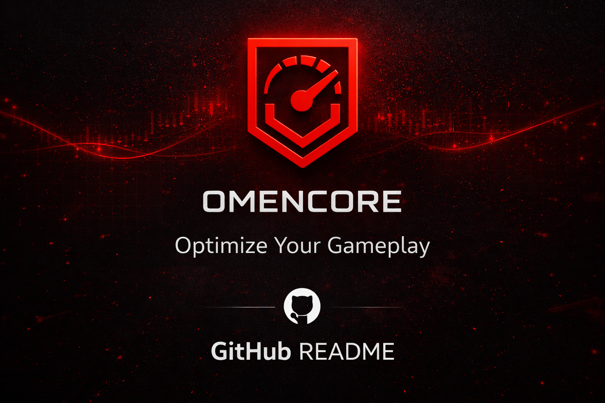
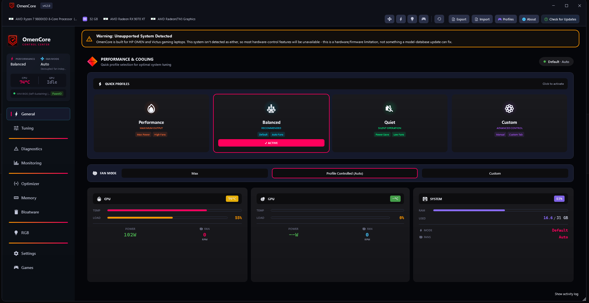

<div align="center">



# OmenCore

### Lightweight local control for HP OMEN and Victus gaming laptops

[](https://omencore.info)
[](docs/CHANGELOG_v4.1.6.md)
[](LICENSE)
[](https://dotnet.microsoft.com/download/dotnet/8.0)
[](https://discord.gg/9WhJdabGk8)

</div>

---

OmenCore is an independent control center for HP OMEN and Victus systems. It focuses on the local workflows people actually use in OMEN Gaming Hub: fan control, performance profiles, telemetry, keyboard lighting, OSD, power tools, diagnostics, and safe cleanup of HP background software.

It runs without ads, account prompts, cloud telemetry, or OMEN Gaming Hub. Hardware access is handled through local WMI BIOS, EC, PawnIO, Linux sysfs, and platform backends when the device exposes them.



## At A Glance

| Area | What OmenCore Provides |
|---|---|
| Fan and thermal control | WMI BIOS fan profiles, Max/Auto handoff, custom curves where the model safely supports them |
| Performance profiles | Quiet, Balanced, Performance, custom profile routing, power-policy diagnostics |
| GPU controls | MUX switching and GPU Power Boost on supported OMEN firmware |
| RGB | OMEN keyboard zone lighting plus external RGB provider integration where supported |
| Monitoring | CPU/GPU temperature, load, fan telemetry, health state, history, and core-control diagnostics |
| OSD and tray | Click-through overlay, hotkey toasts, quick popup, live tray status |
| Cleanup | OMEN Gaming Hub and HP bloatware detection/removal helpers |
| Linux | CLI and Avalonia GUI for supported hp-wmi/ec_sys/sysfs paths |

## Why People Use It

| OmenCore Principle | Result |
|---|---|
| Local first | No sign-in, no ads, no outbound telemetry ([details](docs/TELEMETRY.md)) |
| Safety gated | Unsupported EC/fan/RGB paths stay hidden or diagnostic-only |
| Field driven | Model quirks are tracked by ProductId, BIOS behavior, and logs |
| Fast startup | Hardware polling and heavy providers are deferred where possible |
| Honest capability UI | Requested, confirmed, degraded, and unsupported states are separated |

## Current Release

**Version:** 4.1.6<br>
**Status:** Code-complete and test-verified in this environment (1005/1005 tests, 0 build warnings); artifacts not yet built or tagged<br>
**Release notes:** [docs/CHANGELOG_v4.1.6.md](docs/CHANGELOG_v4.1.6.md)<br>
**Roadmap:** [docs/ROADMAP_v4.0.0.md](docs/ROADMAP_v4.0.0.md)

v4.1.6 is a patch found while triaging field reports, including an exceptionally detailed one (GitHub #159) and a Discord report from board `8DCD`. The most significant fixes: `PerformanceModeService` was attempting CPU/GPU EC power-limit writes to register addresses its own code documents as unconfirmed placeholders ("EXAMPLE - varies by model!", with an explicit hardware-damage warning) by default on any board that didn't opt out — a new, dedicated capability flag now defaults this off for every board until a model's real register addresses are confirmed. Separately, switching Performance Mode while Max fan mode was active cleared OmenCore's internal tracking without releasing the actual BIOS Max-fan latch, leaving fans stuck at maximum until the app was closed — `WmiFanController.SetPerformanceMode` now releases the latch correctly. Two smaller GPU Power Boost diagnostics-clarity fixes ride along: status text no longer claims NVAPI power limits are available when they aren't, and no longer silently shows a saved preference as active when the hardware hasn't actually reached it yet.

### v4.1.6 Highlights

- **Fixed:** unconfirmed EC power-limit register writes (CPU PL1/PL2, GPU TGP) were attempted by default on any board that didn't explicitly opt out — a new `SupportsEcPowerLimits` capability flag now defaults this off everywhere until a model's addresses are field-confirmed. Safety-relevant; no board has ever had these addresses confirmed correct.
- **Fixed:** switching Performance Mode away from an active Max fan hold cleared OmenCore's internal state without releasing the real BIOS `SetFanMax` latch, leaving fans stuck at maximum speed until the app was fully closed (reported on board `8DCD`, HP Victus 15 fa2082wm) — `WmiFanController.SetPerformanceMode` now releases the latch before clearing its tracking flags.
- **Fixed:** GPU Power Boost status text claimed "NVAPI power limits available" based on the wrong capability flag (checked "NVAPI initialized" instead of "power limits actually writable") — could show that note even when the log showed NVAPI reporting no writable power policy.
- **Fixed:** GPU Power Boost status text didn't flag when a saved preference (e.g. "Maximum") doesn't match what's actually on the hardware yet (e.g. because startup restore is disabled) — now says so explicitly instead of reading as if the saved value were already active.

Full detail on every item in [docs/CHANGELOG_v4.1.6.md](docs/CHANGELOG_v4.1.6.md).

### v4.1.5 Highlights (previous release)

- **Fixed:** GPU Power Boost never worked on Victus 16-d1176TX (board `8A25`) — added the model-database entry this exact board was missing, with `SupportsGpuPowerBoost = true`.
- **Fixed:** locked fan-curve/direct-control tooltips said "unavailable for this model" with no explanation, which real users misread as related to the separate "unverified model" status — now explicitly states it's a hardware/firmware limitation.
- **Fixed:** `ApplyMaxCooling()` silently reported success even when the hardware write failed, including in the thermal-critical safety-override path — fans could stay unchanged during a real overheat event while the log and UI both claimed "Max cooling active."
- **Fixed:** Razer RGB effect setters (static/breathing/spectrum/wave/reactive/custom) reported success with no active Chroma SDK session — same silent-failure bug class as the Logitech fix in 4.1.0, found during a follow-up audit.
- **Fixed:** Corsair RGB write failures were indistinguishable from success across all three SDK backends (stub/iCUE/direct-HID) — a device write that silently failed was still counted and logged as applied.
- **Fixed:** the top-level "Unsupported or Unverified Gaming System" banner conflated two different states — a genuinely supported OMEN/Victus with an unconfirmed model got no banner at all despite the text claiming to cover it. Now two independently-gated banners.
- **Fixed:** `SettingsView.xaml` accessibility labeling, left at 53/156 controls in an earlier cycle, is now complete (156/156) — closes out the multi-session accessibility pass across all six views.

Full detail on every item in [docs/CHANGELOG_v4.1.5.md](docs/CHANGELOG_v4.1.5.md).

### v4.1.0 Highlights (previous minor)

- **Fixed:** the sidebar and General-tab main cards could show different temperatures at the same instant — the sidebar was subscribed directly to raw, unfiltered sensor data and bypassed the same spike-rejection/stabilization every other surface received.
- **Fixed:** "temperature appears frozen" was a false positive most of the time — the detector didn't account for HP WMI's whole-degree sensor quantization, so a machine sitting at real thermal equilibrium (steady load, steady temp) was flagged as a stuck sensor. One field session alone logged 48 false warnings.
- **Fixed:** fans re-asserting to Max in a loop for ~2.5 minutes after a thermal emergency on board `8A18` — the "still holding Max?" health check used a floor that was mathematically unreachable on this board's hardware.
- **Fixed:** the per-model GPU Power Boost capability flag was dead code on every Victus board — a blanket vendor-family deny (added for a real 2023 bug) short-circuited before the database flag was ever consulted, so a field-verified entry could never take effect.
- **Fixed:** `PowerAutomationService` (AC/Battery profile switching) never actually applied real CPU/GPU wattage on 57 of 59 boards in the database — it built a bare zero-watt object instead of routing through the existing, already-safe wattage-aware apply path. This affected every user who enabled the feature, on both AC and Battery transitions, not just the specific "Silent battery profile" report that led to finding it.
- **Fixed:** three diagnostics collectors — `hardware-info.txt`, `ec-state.txt`, and the Max-mode-ownership fields in `core-control-readiness.txt`/`monitoring-cadence-hold.txt`/`tuning-fan-focus.txt`/`wmi-command-history.txt` — had never produced real data in any diagnostics export ever generated, on any board, across every version checked. Found by reading real users' exports directly rather than waiting for another report.
- **Fixed:** a Logitech RGB device whose HID++ 1.0 fallback was structurally unreachable — every lighting write silently failed while the app logged success anyway. One real session showed 960 failed writes in a 3-minute window.
- **Fixed:** the CPU-temperature-authority selector (which of WMI BIOS / ACPI Thermal Zone / LibreHardwareMonitor is trusted right now) only debounced switching *back* to WMI BIOS — every other transition switched on a single noisy reading. One real session logged ~192 flip-flops; the debounce is now symmetric.
- **Fixed:** `system-info.txt` reported the .NET garbage-collector heap size mislabeled as "RAM" (explains why it read 16-51 MB on a real laptop) — now reports actual installed physical memory.
- **Added:** a diagnostic-only warning for sustained high-temperature/unexpectedly-low-RPM readings (the exact evidence a still-open thermal-safety report needs) — doesn't change any fan-control decision.
- Confirmed real background-RAM usage from real users' sessions (355-705 MB main app, plus 48-174 MB for the hardware-worker process) — the community complaint is real, not overstated; isolating the exact contributor is still open.

Several fixes above are code-provable from the reporters' own logs but still need their confirmation that the physical/audible behavior matches on real hardware — see Known Limits below. Full detail on every item, including what was traced but deliberately *not* changed pending field evidence, in [docs/CHANGELOG_v4.1.0.md](docs/CHANGELOG_v4.1.0.md).

### v4.0.0 Highlights (previous major release)

- **Architecture:** introduced a real DI composition root — 19 of ~40 manually-wired `MainViewModel` fields migrated onto it, and the hardware bring-up sequence (NVAPI/PawnIO/WMI BIOS/capability detection/EC/fan-controller construction) extracted into its own `HardwareBringup` class as a prerequisite for the rest.
- **Architecture:** built a shared `PollingScheduler`/`UiPollingCoordinator` and migrated the tray icon, quick popup, and OSD timers onto it — a first cut at consolidating a 27-timer sprawl (corrected from an earlier "21 timers" estimate) across three different timer APIs.
- **Removed** ~80 lines of dead, orphaned CPU-undervolt UI wiring in `MainViewModel` — a second, meaningfully-behind copy of `SystemControlViewModel`'s real implementation, bound only to a view that was never in the app's visual tree.
- **Fixed a safety-gate bug:** the OMEN 16/Victus sensitive-model startup-restore check had a live, un-updated copy of the exact fragile-string-match bug already fixed elsewhere in 3.8.1 — could silently skip the extra safety opt-in it exists to enforce.
- **Fixed:** the "disable thermal protection" toggle's documented promise ("fans will NEVER be automatically overridden") didn't actually hold for custom fan curves — a separate always-on safety clamp ignored the toggle. Also made the emergency-override temperature itself configurable (was a hardcoded 95°C).
- Community-contributable model-database pipeline: JSON schema, a dependency-free validator, a PR template, and a CI job — so new hardware support no longer has to funnel through one person hand-writing every entry.
- New persistent "Model Capabilities" panel on the Diagnostics tab — shows what your detected model does and doesn't support, and whether that profile is field-verified or inferred, before you go looking for a setting that isn't there.
- Game profiles: window-title disambiguation for same-exe-different-game cases, WMI event-based process detection replacing pure polling, and multi-game restore handling (switches to a still-running game's profile instead of unconditionally restoring defaults).
- Accessibility: `AutomationProperties` labeling added across Dashboard, Advanced, FanControl, Lighting, and (partially) Settings views — roughly 140 previously-silent controls now announce correctly to screen readers.
- Tray menu: "Max Fan" promoted to one click deep (was three), plus a new in-app notification history and a persistent "Report a Problem" entry reachable regardless of Lite/Advanced mode.
- Corrected a stale risk record: `BiosUpdateService` was documented as "the firmware-write path" — it never writes firmware at all, only checks for updates and hands off to HP's own tools. Added 19 tests for the parts that actually matter (version comparison, URL construction).
- New interactive GitHub Pages site (replaces the old custom omencore.info site) with live release info, a feature/comparison showcase, and donation info.

Full detail in [docs/CHANGELOG_v4.0.0.md](docs/CHANGELOG_v4.0.0.md).

### v3.9.0 Highlights

- **Silent failure:** the OMEN key action setting (Settings → OMEN Key) was completely non-functional for all four UI options — the saved string never matched any backing enum value, so any non-default choice was silently discarded on every relaunch.
- **Silent failure:** newly created or duplicated game profiles were lost if the app crashed before another action triggered a save — `CreateProfile()`/`DuplicateProfile()` never persisted.
- **Silent failure:** `FanController.ResetEcToDefaults()` and bridge-temperature reads swallowed exceptions with no diagnostic trail; both now log the failure (no control-behavior change).
- **Silent failure:** crash reports never included a stack trace, making community bug reports nearly impossible to diagnose from the log alone; both global exception handlers now log full `[CrashTrace]` stacks.
- Tray icon: white temperature-digit text on the yellow/green badge background is now black above a computed luminance threshold — fixes an eye-straining contrast issue reported on Discord.
- Quick Access popup: new "Enable quick access popup" toggle so users who keep hitting Display Off by accident can disable the whole popup instead of losing the OMEN key entirely.
- GPU Power Boost now actually follows the General tab's Performance/Balanced/Quiet profile cards, the tray quick-profile menu, and the hotkey cycle — previously the boost level was frozen at whatever was last set manually, regardless of profile.
- Fixed the Custom tab rendering with the default white WPF theme instead of the app's dark theme (a local `TabItem.Style` was overriding the shared dark template).
- OSD performance-mode row no longer shows a stale "Balanced" default before the first confirmed runtime state arrives; falls back to the last explicitly-applied mode instead of a hardcoded default.
- OSD no longer silently drops behind borderless/windowed-fullscreen games — it now re-asserts topmost every second instead of only once. True DXGI exclusive fullscreen still can't show any overlay window (a Windows compositor limitation).
- Fixed an idle-time integer overflow in Automation Service rules that could misbehave after ~24.9 days of uptime, and a battery-percentage automation bug that could fire "above N%" rules constantly on desktops/sensor-failure systems.
- Fixed the auto-updater's HardwareWorker shutdown sequence: one process failing to close no longer skipped closing the rest, and the installer now waits for confirmed exit instead of assuming it.
- Direct model entries added for HP Victus 15-fa1xxx (`8C3F`, fan-control delay fix) and OMEN 16 (2024) wf1xxx Intel (`8C77`, V1/V2 profile-mismatch crash fix), a family-fallback profile for HP Victus 15 2025 AMD (`fb3xxx`), plus an OMEN Transcend 14 (`8C58`) capability alignment.

### v3.8.2 Highlights (previous patch release)

- **Critical:** fixed an Application Hang within 10-20s of launch (`8BCD`) caused by a named-pipe desync between the app and its out-of-process hardware worker — concurrent requests could race and consume each other's stale replies, with no reconnect-on-failure.
- **Critical (safety):** fixed fans stuck at max independent of temperature, lid-close failing to suspend, and a resulting BIOS thermal shutdown ([#146](https://github.com/theantipopau/omencore/issues/146)) — the Max-mode keepalive timer is now stopped unconditionally on suspend, not just as a side effect of a successful restore.
- Power Automation's AC/Battery fan and performance profiles now actually apply at app startup — previously they only took effect on the next power-source change.
- Diagnostics export wiring fix: `wmi-command-history.txt`, `hardware-info.txt`, and `ec-state.txt` had been empty placeholders in every diagnostics zip ever exported, regardless of hardware state; bug reports going forward will contain real data.
- Fixed the Optimizer's "Disable Last Access Timestamps" toggle always reporting itself as failed even when it had applied correctly (a registry-encoding mismatch, not an elevation issue).
- Fixed a rare, timing-dependent background crash in the fan monitor loop during shutdown.
- New conservative identities added for OMEN Slim 16-an0xxx (`8D40`), OMEN 17-ck1xxx (`8A18`), and OMEN Transcend 14-fb1xxx (`8E41`).

### v3.8.1 Highlights (previous patch release)

- `8A18` OMEN 17-ck1xxx: conservative exact capability profile, with V1 fan-level fallback explicitly labeled as an estimate rather than measured RPM, and fan verification evidence kept honest about command-success vs. physical confirmation.
- Quick Access popup shortcut is now configurable (Display Off, Lock Windows, or Disabled) to prevent accidental display-off clicks.
- Saved Custom fan-curve selection now migrates correctly when `LastFanPresetName` is missing or stale, without bypassing the startup fan-write safety gate.
- GPU OC Tuning page shows a dedicated startup-reapply status chip explaining whether a confirmed profile is enabled or blocked, and why.
- The OMEN 16/Victus sensitive-model startup-restore safety override now matches real-world HP model-name variants instead of only the literal "OMEN 16" substring.
- OMEN-key diagnostics now record the last accepted/rejected key candidate (source, VK/scan codes, and reason) for field debugging of #141-class reports.
- `HpWmiBios` heartbeat, the fan countdown-extension reassert loop, and the Razer Chroma heartbeat are now visible in background-timer diagnostics.
- `8D40` OMEN Slim 16-an0xxx: exact conservative identity added (GitHub #145), replacing low-confidence family fallback.
- Fixed Performance Profile silently reverting to Balanced after relaunch when changed via the tray menu, the `Ctrl+Shift+E` hotkey cycle, or the General page's quick-profile buttons (GitHub #145) — these paths now persist the choice the same way the System Control page always did.

Older release notes ([v3.8.0](docs/CHANGELOG_v3.8.0.md) and earlier) are kept in `docs/` rather than summarized here.

## Current Development Focus

**v4.1.6 is a patch found while triaging GitHub #159** (an exceptionally detailed field report on a different board/vendor than 4.1.5's Victus report) and a Discord report from board `8DCD`. The significant fixes: `PerformanceModeService` was attempting CPU/GPU EC power-limit writes to register addresses the code's own header comment documents as unconfirmed ("EXAMPLE - varies by model!", explicit hardware-damage warning) by default, on any board that didn't opt out — the gate reused a flag meant for real EC fan control, which defaults to `true`. A new, dedicated flag now defaults this off everywhere until a model's addresses are field-confirmed; no board has ever had this confirmed, so nothing regresses. Separately, `WmiFanController.SetPerformanceMode` cleared its internal Max-mode tracking without releasing the real BIOS `SetFanMax` latch, leaving fans stuck at maximum until the app was closed — now fixed to release the latch first. Two GPU Power Boost status-text fixes ride along, both traced from the GitHub #159 report. The Victus/8A25 GPU Power Boost wattage question from 4.1.5 is still open — traced further via git history (the WMI payload is confirmed stable and reference-implementation-aligned, not the cause) but not fixed, holding for more field evidence per owner call.

**What's intentionally *not* in this release:** the larger architectural items from 4.1.0 — privilege separation, a real RGB provider architecture, i18n, Linux tray/config persistence — remain scoped in the roadmap but not started. `SystemControlViewModel`'s EC-based GPU-boost fallback path (a different, still-ungated EC write of the same risk class as the one fixed here) was found in the same pass but not touched — logged for a dedicated fix.

The active work is tracked in:

- [docs/CHANGELOG_v4.1.6.md](docs/CHANGELOG_v4.1.6.md) - the current release notes.
- [docs/ROADMAP_v4.0.0.md](docs/ROADMAP_v4.0.0.md) - the full scope, phase ordering, and execution checklist this and the prior cycles worked through.
- [docs/CHANGELOG_v4.1.5.md](docs/CHANGELOG_v4.1.5.md) - the prior release's notes and validation status.

Prior-release work is kept for historical reference:

- [docs/CHANGELOG_v3.9.0.md](docs/CHANGELOG_v3.9.0.md), [docs/CHANGELOG_v3.8.2.md](docs/CHANGELOG_v3.8.2.md), [docs/CHANGELOG_v3.8.1.md](docs/CHANGELOG_v3.8.1.md), [docs/CHANGELOG_v3.8.0.md](docs/CHANGELOG_v3.8.0.md) - field fixes, UI polish, diagnostics, and validation status for each release.
- [docs/3.8.1-BUG-REPORTS.md](docs/3.8.1-BUG-REPORTS.md), [docs/3.8.0-BUG-REPORTS.md](docs/3.8.0-BUG-REPORTS.md) - tracked model reports and issue follow-up.

The consolidated `core-control-readiness.txt` diagnostic report (fan backend/readback state, RGB surface/backend state, tuning startup/readback state, monitoring health, next validation actions) introduced in 3.8.0 remains in place, joined in 4.0.0 by the persistent "Model Capabilities" panel on the Diagnostics tab. Several of its fields were confirmed broken and fixed in 4.1.0 — see the changelog.

## Downloads

Release artifacts are published on the [GitHub Releases](https://github.com/theantipopau/omencore/releases/latest) page.

| Artifact | Platform | Recommended For |
|---|---|---|
| `OmenCoreSetup-4.1.6.exe` | Windows | Most users. Installs app and can install PawnIO. |
| `OmenCore-4.1.6-win-x64.zip` | Windows | Portable use, testing, or no installer preference. |
| `OmenCore-4.1.6-linux-x64.zip` | Linux | CLI plus Avalonia GUI, self-contained runtime. |

Final GitHub release notes must include SHA256 hashes for every artifact. The in-app updater requires release hashes before it will install an update.

## Quick Start

### Windows

1. Download `OmenCoreSetup-4.1.6.exe` from [Releases](https://github.com/theantipopau/omencore/releases/latest).
2. Verify the SHA256 hash from the release notes.
3. Run the installer as Administrator.
4. Keep PawnIO selected unless you only want monitoring and WMI-only features.
5. Launch OmenCore from the Start Menu.

Portable users can download `OmenCore-4.1.6-win-x64.zip`, extract it to a normal folder, and run `OmenCore.exe` as Administrator.

See [INSTALL.md](INSTALL.md) for the full Windows guide.

### Linux

```bash
VERSION=4.1.6
wget "https://github.com/theantipopau/omencore/releases/download/v${VERSION}/OmenCore-${VERSION}-linux-x64.zip"
mkdir -p OmenCore-linux-x64
unzip "OmenCore-${VERSION}-linux-x64.zip" -d OmenCore-linux-x64
cd OmenCore-linux-x64
chmod +x omencore-cli omencore-gui

sudo ./omencore-cli status
./omencore-gui
```

Prefer launching the GUI as your normal desktop user. Use `sudo` for CLI operations that need hardware access.

For bug reports, collect a triage bundle:

```bash
./qa/collect-linux-triage.sh
```

See [INSTALL.md](INSTALL.md) and [docs/LINUX_INSTALL_GUIDE.md](docs/LINUX_INSTALL_GUIDE.md) for Linux details.

## Feature Matrix

### Thermal And Fan Control

- WMI BIOS fan profile control on supported OMEN/Victus laptops.
- Max, Auto, Quiet, Gaming, Extreme, and custom presets where capability allows.
- Custom fan curves with temperature breakpoints on models with validated curve support.
- Profile-only fan gating for models where the firmware supports OEM profile modes but not safe manual curve writes.
- Restore OEM Auto action to release OmenCore fan ownership and return to firmware auto mode.
- Fan command history, launch diagnostics, and core-control readiness exports for field validation.

### Performance And Power

- Quiet, Balanced, Performance, and custom profile routing.
- WMI thermal-policy fallback when direct EC/MSR power limits are unavailable.
- CPU/GPU power apply traces in diagnostics.
- Intel undervolt and TCC controls where the model, BIOS, and runtime allow them.
- GPU Power Boost on supported OMEN firmware.
- GPU OC and power-limit profile storage where backend support is available or power-limit-only routing is exposed.
- MUX switching where the BIOS exposes Hybrid, Discrete, or Integrated modes.

### RGB And Lighting

- OMEN 4-zone keyboard lighting with profile, zone, brightness, and backlight operations.
- Model-aware fallback and serialized keyboard lighting writes.
- RGB diagnostics showing backend ownership, active path, and conflict status.
- OMEN Max per-key-capable hardware detection plus first-pass HID per-key routing for known/inferred HP keyboard controller PIDs.
- External RGB provider surfaces for Corsair, Logitech, Razer, OpenRGB, and system providers where available.
- Built-in RGB scenes include static, breathing, spectrum, wave, ambient, audio-reactive, Heat Wave, Calm Pulse, and Lights Off paths where providers support them.
- Readiness diagnostics report the active HP keyboard surface, observed physical surface, and whether a result is verified, accepted/unverified, unavailable, or blocked by a conflict.

Note: OMEN Max dedicated HID per-key routing is intentionally conservative until field logs confirm the correct USB PID list and physical keyboard segment mapping.

### Monitoring, OSD, And Diagnostics

- CPU/GPU temperature, load, fan level/RPM, battery, memory, storage, and GPU telemetry.
- Out-of-process hardware worker for crash isolation.
- Telemetry health states: valid, inactive, unavailable, stale, degraded, and invalid.
- Click-through OSD with RTSS FPS integration where available.
- RTSS FPS display falls back to average FPS when instant FPS is unavailable and keeps RTSS unavailable/waiting states explicit.
- Tray quick popup and status badges.
- Diagnostic exports with model identity, RGB path, resource footprint, fan history, launch readiness, core-control readiness, tuning safety, and runtime state.

### System Tools

- Guided OMEN Gaming Hub cleanup.
- Bloatware scanner and removable HP app inventory.
- Memory optimizer and gaming-mode helpers.
- Per-game profile automation with exact executable-path matching, duplicate apply suppression, optional default restore on exit, and feature-gated process monitoring.
- Auto-update with SHA256 verification.

## Hardware Support

OmenCore is built for HP OMEN and HP Victus laptops. Desktop OMEN systems are treated conservatively.

| Hardware Class | Support Level | Notes |
|---|---|---|
| OMEN 15/16/17 laptops | Primary | WMI BIOS, fan/profile, telemetry, RGB, power features by model |
| Victus laptops | Supported with gates | Fan/profile/monitoring/backlight; GPU TGP and undervolt often unavailable |
| OMEN Max 16/17 | Active validation | Power/profile identity paths; HID per-key RGB backend needs PID/segment field confirmation |
| OMEN Transcend | Active validation | Profile-based fan and lighting paths vary by ProductId |
| OMEN desktops | Limited | Monitoring/profile/cleanup; fan writes are safety-gated |
| HP Spectre and other HP | Limited | Monitoring and selected WMI paths only |
| Non-HP systems | Unsupported | Monitoring-only behavior may work, control features are not targeted |

Model support is keyed by ProductId where possible. Diagnostic exports include a model identity summary so unsupported or inferred profiles can be fixed without guesswork.

## Requirements

### Windows

- Windows 10 build 19041+ or Windows 11.
- Administrator rights for WMI BIOS, EC, MSR, fan, and power operations.
- Self-contained .NET 8 runtime in release builds.
- PawnIO recommended for advanced EC/MSR features and Secure Boot-compatible low-level access.

### Linux

- x64 Linux with `hp-wmi`, `ec_sys`, or compatible hwmon/sysfs interfaces.
- Root privileges for hardware writes.
- A normal desktop session for the Avalonia GUI.
- Kernel support varies heavily by model and distro.

## Backend Priority

Windows fan control normally follows this order:

1. WMI BIOS - preferred for modern OMEN laptops.
2. PawnIO-backed EC/MSR paths - advanced access where safe and validated.
3. OGH proxy - last-resort fallback when local firmware paths require it.

Linux control normally follows available sysfs/hwmon capability:

1. `hp-wmi` / platform profile.
2. `hp-wmi` hwmon PWM and fan input paths.
3. `ec_sys` for older models.
4. Diagnostic-only mode when no safe write path exists.

## Known Limits

Unlike 4.0.0 (architecture-only, no fan/thermal/EC behavior changed), 4.1.0 does have several items that are code-provable from real logs but still need field confirmation on the reporters' actual hardware:

- `8A18` OMEN 17-ck1xxx: the fan-reassert-loop fix (GitHub #153) is code-complete and test-verified, and the logic bug is provable from the reporter's log alone — but only they can confirm the audible/physical repeated-re-assertion behavior actually stops.
- `8D87`/`AK0003NR` OMEN Max 16 (AMD): the CPU-power-ceiling root cause is traced and a one-line fix identified (`AllowDecoupledWmiThermalPolicyFallback = true`), but deliberately **not applied** — it's a genuine hardware-behavior change on `UserVerified = false` boards and needs a reporter to confirm it actually raises CPU package power with no adverse thermal/fan/stability effects first.
- `8C2F` Victus 15/16 (shared board ID): the naming/metadata fix is safe and applied, but whether the 16" chassis's capability assumptions (fan/RGB/thermal behavior) actually hold on the 15" chassis is still unconfirmed.
- `8A25` HP Victus 16-d1176TX: `SupportsGpuPowerBoost` was flipped to `true` in 4.1.5 after three consecutive versions of consistent reports — an owner judgment call, not a session log with explicit before/after wattage figures. Still needs a reporter to confirm the RTX 3060 actually reaches 100W boost through OmenCore's own code path, not just OGH.
- `8D41` board keyboard zones 4-7 (Darfon HID controller): the light-bar zones (0-3) are fixed via the correct Linux sysfs path; the keyboard zones still need the reporter's offered USB HID feature-report capture before a backend can be written.
- The Logitech HID++ 1.0 fallback fix has no automated test coverage (no mockable HID hardware abstraction exists in this codebase) — code-review-verified only; a report from anyone with an HID++-1.0-only Logitech device confirming lighting now actually applies would help.
- The CPU-thermal-authority debounce fix is directionally safe (can only make source switches less frequent, never more) but hasn't been confirmed against a real board that reproduced the original flip-flop.

Carried forward from 4.0.0 / 3.9.0 (untouched by this cycle's work):

- `8C77` OMEN 16 (2024) wf1xxx Intel: the V1/V2 profile-mismatch fix is code-complete and test-verified but **not yet confirmed on the reporter's physical hardware**.
- `8BCD` OMEN 16 xd0010AX: four fan-behavior reports (Balanced-switch oscillation, Quiet RPM floor, Quiet thermal ceiling, ramp-down stepping) are evidence-gated — no fan/thermal code was changed without physical-hardware evidence, per project safety policy.
- The hang fix (`8BCD`), the fan-stuck-at-max/failed-standby fix (`88D2`), and the Power Automation/Optimizer fixes (`8D41`) from v3.8.2 remain code-complete and test-verified in this environment but **not yet confirmed on the reporters' physical hardware** — see Release Conditions in [docs/CHANGELOG_v3.8.2.md](docs/CHANGELOG_v3.8.2.md).
- Some 3.8.0 and 3.8.1 fixes still require physical hardware validation, especially fan ramp-down, RGB surface routing, and GPU wattage parity.
- OMEN Max per-key RGB now has a first-pass HID backend in active development, but it is not fully verified until field logs confirm the USB PID list and physical segment behavior.
- `8DCD` Victus 15 fan-speed collapse under sustained load (GitHub #143) is still under investigation and treated as thermal-safety critical until disproven; 4.1.0 added a diagnostic-only warning for sustained high-temp/low-RPM readings so the next reproduction's log carries unambiguous evidence, but the root cause itself is unresolved.
- `8D26` OMEN 16-ap0xxx dedicated key and Fn+P event routing (GitHub #141) needs shipped-artifact and physical-hardware confirmation.
- `8E41` OMEN Transcend 14 idle-load thermal-emergency reports are under investigation; current evidence leans toward real (brief) thermal excursions rather than a sensor glitch, but the zero-debounce safety response itself is deliberately unchanged either way.
- OGH Eco mode parity is tracked but not implemented.
- Direct PL1/PL2 controls remain firmware/MSR gated on many systems.
- OSD now fights back against borderless/windowed-fullscreen games stealing topmost (fixed in 3.9.0). True DXGI exclusive-fullscreen still cannot show any overlay window — that's a Windows compositor limitation, not something a WPF window can override without D3D/DXGI hook injection.
- `8574` legacy OMEN 15 support is partial until fresh diagnostics confirm effective fan command readback.

## Active Validation Targets

New this cycle (4.1.0):

- `8A18` OMEN 17-ck1xxx: confirm fans no longer repeatedly re-assert to Max after a thermal emergency clears (GitHub #153) — the log-provable loop is fixed, only the audible/physical behavior needs confirming.
- `8D87`/`AK0003NR` OMEN Max 16 (AMD): test a build with `AllowDecoupledWmiThermalPolicyFallback` flipped and confirm CPU package power actually rises toward 105W with no adverse thermal/fan/stability effects before it's merged.
- `8C2F` Victus 15/16: confirm fan/RGB/thermal behavior on the 15" chassis actually matches the assumptions inferred from the 16" report.
- `8A25` HP Victus 16-d1176TX: confirm GPU Power Boost actually reaches 100W through OmenCore now that the capability flag is flipped in 4.1.5 (owner call after three consistent reports, not a session-log confirmation).
- Anyone with an HID++ 1.0-only Logitech RGB device: confirm lighting now actually applies (previously silently failed while logging success).

Carried forward from 4.0.0 / 3.9.0:

- `8C77` OMEN 16 (2024) wf1xxx Intel: confirm the direct model entry and V1 fan-control path resolve the `FileNotFoundException` crash on the Custom Fan Curve tab.
- `8BCD` OMEN 16-xd0010AX: per-poll EC register dump during Balanced-switch fan oscillation; RPM vs. EC register snapshot for the Quiet RPM floor; WMI ThermalPolicy + per-zone temp log at the Quiet thermal ceiling; 100ms-resolution RPM log during ramp-down.
- `8BCD` OMEN 16-xd0010ax: confirm the named-pipe hang fix actually stops the Application Hang on the original reporter's hardware.
- `88D2` OMEN 15-en1xxx: confirm the Max-mode keepalive fix lets lid-close suspend cleanly with no BIOS thermal shutdown.
- `8D41` OMEN MAX 16 ah0500na: RGB light-bar-vs-keyboard routing and battery-preset-name substitution still need a session log (Power Automation boot-apply itself is now confirmed fixed at the code level).
- `8D40` OMEN Slim 16-an0xxx: exact identity validation, plus Battery Care (Charge Limit) WMI evidence — now collectible via the fixed diagnostics export.
- `8DCD` Victus 15: bounded, abortable load test confirming Performance mode no longer drops below 2000 RPM above 80C — the next attempt will carry unambiguous evidence from 4.1.0's new diagnostic warning either way.
- `8D26` OMEN 16-ap0xxx: Fn+F2 never-intercept behavior and dedicated OMEN-key/Fn+P event path on physical hardware.
- `8E9A` HyperX OMEN MAX 16t-ah100: exact conservative identity pending full diagnostic evidence.
- `8E41` OMEN Transcend 14-fb1xxx: diagnostics-zip-level raw per-poll temperature evidence for the idle thermal-emergency reports.
- `8D87` OMEN Max: WMI-only Max fan hold, Restore OEM Auto, and HID per-key RGB PID confirmation.
- `8BD4` Victus 16: conservative WMI V1 Auto/Max handoff and WMI ColorTable RGB confirmation.
- `8C30` Victus 15-fb1xxx: Quiet/Balanced/Performance WMI policy routing and wattage/RPM readback validation.
- `878C` OMEN 15-ek0xxx: Quick Profile fan wake/ramp validation after exact WMI fallback routing.
- `8600` OMEN 15-dh0xxx: PawnIO install/reboot telemetry recovery plus Quiet/Balanced/Performance/Auto/Max fan-mode validation.
- `88EE` Victus 16-e0194nw: exact ProductId identity confirmation plus fan/RGB/readback evidence before enabling capabilities beyond conservative routing.
- `8BCD` Linux: degraded WMI/ACPI reporting with effective fan/RGB/battery readback before claiming full control.
- GPU OC startup reapply: confirmed-profile reboot test on NVIDIA, plus AMD manual-only wording or equivalent persistence.
- Background memory/responsiveness: scenario-matrix measurement against the 3.8.1 budgets before claiming any reduction.
- Startup restore: keep hardware restore opt-in until fan, RGB, performance, undervolt, and GPU OC readback passes on the target model.

## Development

### Build

```powershell
git clone https://github.com/theantipopau/omencore.git
cd omencore
dotnet restore OmenCore.sln
dotnet build OmenCore.sln --configuration Release
```

### Run Tests

```powershell
dotnet test OmenCore.sln
```

**What "N/N tests passing" actually means:** the suite is a real xUnit test project (`src/OmenCoreApp.Tests`, 1000+ tests as of v4.1.6) that runs in CI on every push (`.github/workflows/ci.yml`) and locally before every release. It exercises hardware-abstraction logic in isolation — capability-database resolution (which model resolves to which `ProductId`/`ModelNamePattern` entry), fan-curve and safety-clamp math, the diagnostics-export pipeline, view-model state transitions, and regression tests pinned to specific field-reported bugs (reflection-driven against private methods/fields where the codebase's existing pattern calls for it, real mock SDK interfaces like `ICorsairSdkProvider` where one exists). **What it does not do:** verify that a given real board's EC/WMI actually responds the way the code assumes — that's a structurally different problem no unit test can cover, which is why this project has a separate, explicit "evidence-gate" convention (see the roadmap and changelogs) requiring field confirmation from real hardware before shipping any fan/thermal/OC/UV *behavior* change, independent of what the test suite says. A green test suite means the logic is provably self-consistent and regression-free; it is not a substitute for a real user confirming a fix works on their actual laptop, and this project's own docs never claim otherwise.

### Build Windows Artifacts

```powershell
pwsh ./build-installer.ps1
```

Expected outputs:

- `artifacts/OmenCoreSetup-4.1.6.exe`
- `artifacts/OmenCore-4.1.6-win-x64.zip`
- `artifacts/SHA256SUMS-4.1.6.txt`

### Build Linux Artifact

```powershell
pwsh ./build-linux-package.ps1
```

Expected outputs:

- `artifacts/OmenCore-4.1.6-linux-x64.zip`
- `artifacts/OmenCore-4.1.6-linux-x64.zip.sha256`
- `artifacts/version.json`
- `artifacts/linux-version-verification-4.1.6-linux-x64.json`

## Release Checklist

Before publishing a stable GitHub release:

1. Confirm `VERSION.txt`, project versions, installer version, README, and INSTALL all match.
2. Run `dotnet restore`, Release build, test suite, and `git diff --check`.
3. Build Windows installer/portable and Linux zip.
4. Generate SHA256 hashes for all artifacts.
5. Add hashes, known limits, and hardware validation status to GitHub Release notes.
6. Upload artifacts.
7. Tag the release only after the final notes and artifacts match.

## Troubleshooting

| Symptom | First Thing To Check |
|---|---|
| Fan control has no effect | Model capability summary and fan command history in diagnostics |
| Fans stay elevated | Use Restore OEM Auto, then export diagnostics with `core-control-readiness.txt` |
| GPU Power Boost changes but wattage does not | Firmware/backend support and FurMark/telemetry readback |
| PawnIO unavailable | Keep PawnIO selected in the installer, reboot, and run as Administrator |
| PawnIO setup asks for `-install` or `-uninstall` | Use v3.8.0+ installer builds; standalone fallback is `PawnIO_setup.exe -install` from an elevated terminal |
| Undervolt hidden | Model or BIOS may block MSR undervolt; check tuning readiness and startup recovery state |
| RGB turns off or does not restore | Check active keyboard backend, target surface, accepted/unverified status, and conflicting HP lighting tools |
| Battery Care (Charge Limit) fails | Confirm AC power is connected; compare against OMEN Gaming Hub; export `wmi-command-history.txt` and BIOS version |
| Performance profile reverts to Balanced after relaunch | Fixed in 3.8.1 for tray/hotkey/General quick-profile changes (GitHub #145); if still seen, note which entry point you used |
| OSD not visible in a game | Fixed in 3.9.0 for borderless/windowed-fullscreen (overlay now re-asserts topmost every second); true DXGI exclusive fullscreen still cannot show any overlay window — switch the game to borderless/windowed-fullscreen mode |
| Linux permission denied | Run CLI command with `sudo` |

Windows logs are stored under `%LOCALAPPDATA%\OmenCore\`. Linux diagnostics can be collected with `sudo ./omencore-cli diagnose --report`.

## Documentation

- [INSTALL.md](INSTALL.md) - installation, upgrade, portable use, Linux setup, uninstall.
- [docs/CHANGELOG_v4.1.6.md](docs/CHANGELOG_v4.1.6.md) - current release notes.
- [docs/ROADMAP_v4.0.0.md](docs/ROADMAP_v4.0.0.md) - current roadmap, scope, and execution checklist.
- [docs/CHANGELOG_v4.1.5.md](docs/CHANGELOG_v4.1.5.md) - previous release notes.
- [docs/CHANGELOG_v3.9.0.md](docs/CHANGELOG_v3.9.0.md) - earlier release notes.
- [docs/3.8.1-BUG-REPORTS.md](docs/3.8.1-BUG-REPORTS.md) - active field report tracking (covers GitHub #141-#146 and Discord reports through v3.8.2).
- [docs/CHANGELOG_v3.8.2.md](docs/CHANGELOG_v3.8.2.md) - earlier release notes.
- [docs/CHANGELOG_v3.8.1.md](docs/CHANGELOG_v3.8.1.md) - earlier release notes.
- [docs/CHANGELOG_v3.8.0.md](docs/CHANGELOG_v3.8.0.md) - earlier release notes.
- [docs/CHANGELOG_v3.7.1.md](docs/CHANGELOG_v3.7.1.md) - earlier release notes.
- [docs/3.8.0-CORE-CONTROLS-NEXT-STEPS.md](docs/3.8.0-CORE-CONTROLS-NEXT-STEPS.md) - core control validation and practical next steps.
- [docs/3.8.0-BUG-REPORTS.md](docs/3.8.0-BUG-REPORTS.md) - prior 3.8.0 field report tracking.
- [docs/FINAL_RELEASE_CHECKLIST.md](docs/FINAL_RELEASE_CHECKLIST.md) - a historical release-gate checklist from the v3.7.1 cycle, kept for reference; not maintained per release.
- [docs/3.7.1-BUG-REPORTS.md](docs/3.7.1-BUG-REPORTS.md) - field report tracking.
- [docs/LINUX_INSTALL_GUIDE.md](docs/LINUX_INSTALL_GUIDE.md) - Linux details.
- [docs/ANTIVIRUS_FAQ.md](docs/ANTIVIRUS_FAQ.md) - antivirus and driver guidance.
- [docs/DEFENDER_FALSE_POSITIVE.md](docs/DEFENDER_FALSE_POSITIVE.md) - Defender guidance.
- [drivers/PawnIO/README.md](drivers/PawnIO/README.md) - PawnIO backend details.

## Version History

| Version | Summary |
|---|---|
| 4.1.6 | Patch release: unconfirmed EC power-limit register writes (CPU PL1/PL2, GPU TGP) now blocked by default on every board via a new, dedicated capability flag decoupled from the EC fan-control flag it previously shared (safety-relevant, found via GitHub #159); fans stuck at maximum after switching Performance Mode away from an active Max fan hold now correctly release the BIOS latch (board `8DCD`); plus two GPU Power Boost status-text fixes from the GitHub #159 report. 1005/1005 tests. |
| 4.1.5 | Patch release: GPU Power Boost enabled on Victus board `8A25`, a locked fan-curve tooltip reworded to stop implying it's about verification status, `ApplyMaxCooling()` fixed to stop reporting success when the hardware write actually failed (including in the thermal-critical safety-override path), matching silent-write-failure bugs fixed in Razer and Corsair RGB, a `MainWindow` banner conflating "unsupported" with "unverified" split into two correctly-gated banners, and `SettingsView.xaml` accessibility labeling completed (156/156 controls). 1000/1000 tests. |
| 4.1.0 | Minor release: field-report fixes for five GitHub issues/two Discord threads (telemetry-mismatch, freeze-heuristic false positive, Max-fan reassert loop, dead GPU-Power-Boost capability flag, board-naming ambiguity, Linux RGB sysfs path), a systemic Power Automation wattage bug found via an older-docs sweep, and four more bugs found by reading real users' diagnostics exports/logs directly (three broken diagnostics collectors never producing real data, a Logitech HID++ fallback silently failing while claiming success, a CPU-thermal-authority selector flip-flopping ~192 times in one session). 990/990 tests. |
| 4.0.0 | Major release: sustainability/architecture cycle, not features-first — DI composition root started (19/~40 `MainViewModel` fields migrated), shared polling coordinator, community model-database contribution pipeline, persistent "Model Capabilities" diagnostics panel, accessibility labeling pass (~140 controls across 5 views), game-profile window-title disambiguation + WMI event-based detection + multi-game restore, dead-code removal, safety-gate string-match audit fix. No fan/thermal/EC control behavior changed. |
| 3.9.0 | Minor release: non-functional OMEN key action fix, game-profile-loss-on-crash fix, silent EC-failure logging, crash stack traces, GPU Power Boost/profile linkage, Custom tab theme fix, OSD stale-default fix, AutomationService idle/battery bugs, HardwareWorker update-kill-loop fix, `8C3F`/`8C77` model additions |
| 3.8.2 | Patch release: critical Application Hang fix (#BUG-3820-001), fans-stuck-at-max/failed-standby fix (#146), Power Automation boot-apply fix, diagnostics-export wiring fix (#145 evidence gap), Optimizer verification fix, fan-monitor-loop shutdown-race fix |
| 3.8.1 | Patch release: GitHub #141-#145 follow-up, fan-telemetry truthfulness, saved Custom curve fix, GPU OC startup-reapply clarity, OMEN-key field diagnostics, performance-profile relaunch persistence fix |
| 3.8.0 | Release candidate: field fixes, fan/RGB/tuning readiness diagnostics, UI responsiveness, model-specific validation |
| 3.7.1 | Quick Access profiles, WMI V1 fan recovery, profile-only fan gating, AMD ADL containment, launch diagnostics |
| 3.7.0 | Runtime recovery, fan/profile authority, OMEN Max identity, Linux diagnose improvements |
| 3.6.3 | Desktop fan-write safety, conservative WMI fan handoff, OSD startup hardening |
| 3.6.2 | Runtime source-of-truth hardening, RGB fallback reliability, Linux diagnostics |
| 3.6.1 | Fan/performance sync, tray/OSD consistency, WMI fan CPU reduction |
| 3.6.0 | Lightweight runtime, hardware-worker reliability, fan/RGB/hotkey hardening |
| 3.5.0 | Diagnostics clarity, safer tuning flow, conflict and recovery guardrails |

Older release notes live in [docs/](docs/).

## Contributing

Useful contributions include fresh diagnostic exports, model ProductId verification, EC/WMI behavior reports, Linux sysfs snapshots, translations, and focused bug fixes. Please include logs and the model identity summary when filing hardware-control issues.

### Requesting Support For An Unrecognized Model

If Diagnostics reports `Unknown <Family> Model` or "Resolution source: Family fallback / Low confidence" (as opposed to an exact ProductId match), your laptop works through conservative generic defaults rather than a model-specific profile. To get it added:

1. Open **Diagnostics** (or **About**) and copy the **Model Identity Summary** in full, including `Capability ProductId`, `Baseboard ProductId`, `WMI model`, `System SKU` / HP support product number, and the keyboard identity lines.
2. Note your CPU, GPU, and BIOS version, and whether fan control, Battery Care, RGB, and performance-mode persistence work or fail individually — a feature that already works via family fallback should stay marked as working so the new profile does not become more restrictive than what you have today.
3. Open a [GitHub issue](https://github.com/theantipopau/omencore/issues) with that summary, your symptoms, and (if relevant) what OMEN Gaming Hub shows for the same feature.
4. Exact identity entries always start conservative: WMI fan/profile control only where evidence already shows it working, with direct EC writes, MUX switching, undervolt, and RGB left unclaimed until a tester confirms the surface exists. Capabilities are widened in a follow-up once that evidence arrives — see [docs/3.8.1-BUG-REPORTS.md](docs/3.8.1-BUG-REPORTS.md) for examples of this pattern (`8D40`, `8A18`, `8E9A`).

## Safety And Disclaimer

OmenCore is provided as-is. Fan control, EC writes, undervolting, GPU power changes, and MUX switching can affect stability and hardware behavior. Use restore points, read capability warnings, and avoid enabling unverified hardware restore paths unless you understand the recovery steps.

OmenCore is not made by or endorsed by HP.

## Links

- GitHub: https://github.com/theantipopau/omencore
- Releases: https://github.com/theantipopau/omencore/releases/latest
- Issues: https://github.com/theantipopau/omencore/issues
- Discord: https://discord.gg/9WhJdabGk8
- Donate: https://www.paypal.com/donate/?business=XH8CKYF8T7EBU

## License

MIT License. See [LICENSE](LICENSE).

Third-party components include LibreHardwareMonitor, Hardcodet.NotifyIcon.Wpf, PawnIO, and vendor RGB SDK files where bundled. See the relevant source folders and driver documentation for details.
